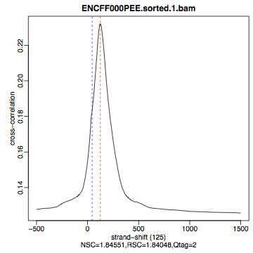
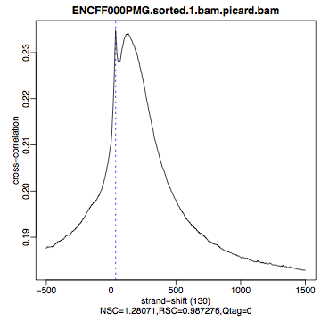
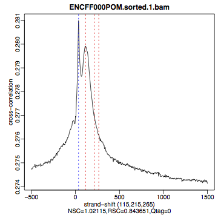
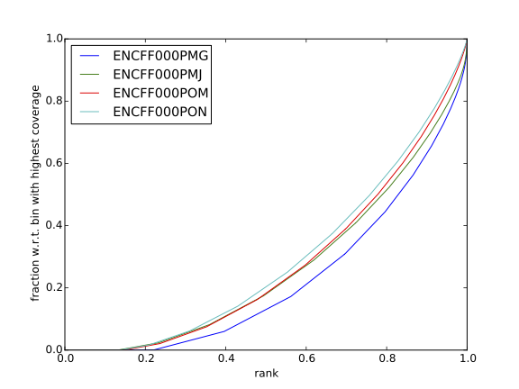
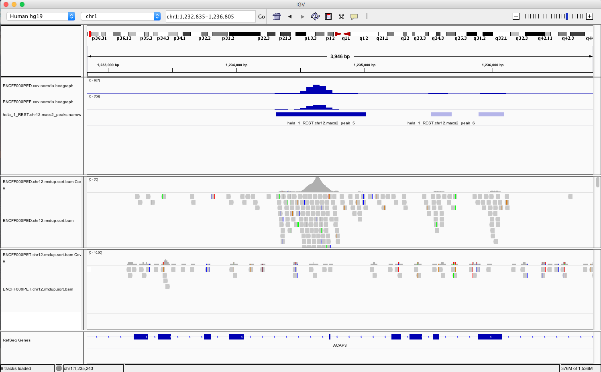
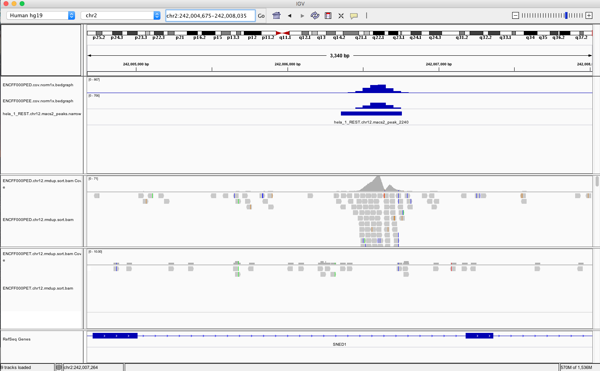
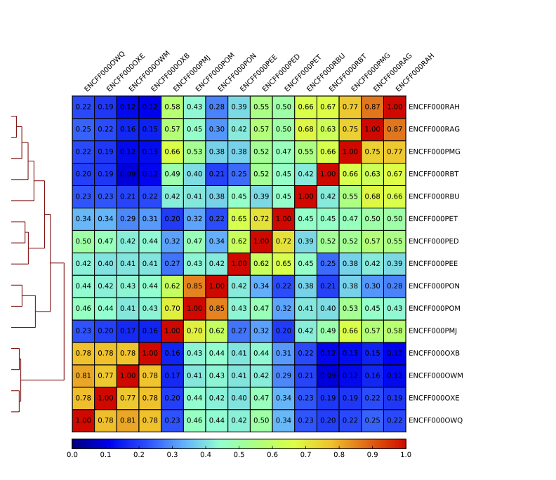

# ChIP-seq data processing tutorial 

## Introduction <a name="Introduction"></a>

REST (NRSF) is a transcriptional repressor that represses neuronal genes in non-neuronal cells. It is a member of the Kruppel-type zinc finger transcription factor family. It represses transcription by binding a DNA sequence element called the neuron-restrictive silencer element (NRSE). The protein is also found in undifferentiated neuronal progenitor cells and it is thought that this repressor may act as a master negative regulator of neurogenesis. In addition, REST has been implicated as tumour suppressor, as the function of REST is believed to be lost in breast, colon and small cell lung cancers.

One way to study REST on a genome-wide level is via ChIP sequencing (ChIP-seq). ChIP-seq is a method that allows to identify genome-wide occupancy patterns of proteins of interest such as transcription factors, chromatin binding proteins, histones, DNA / RNA polymerases etc.

The first question one needs to address when working with ChIP-seq data is "Did my ChIP work?", i.e. whether the antibody-treatment enriched sufficiently so that the ChIP signal can be separated from the background signal. After all, around 90% of all DNA fragments in a ChIP experiment represent the genomic background. This question is impossible to answer by simply counting number of peaks or by visual inspection of mapped reads in a genome browser. Instead, several quality control methods have been developed to assess the quality of the ChIP-seq data. These are introduced in the first part of this tutorial. The second part deals with identification of binding sites and finding consensus peakset. In the third part look at the data: mapped reads, coverage profiles and peaks. All three parts come together to be able to assess the quality of the ChIP-seq experiment and are essential before running any down-stream analysis and drawing any biological conclusions from the data. 

## Content
- [Introduction](#Introduction)
- [Data](#Data)
- [Methods](#Methods)
- [Setting-up](#Setting-up)
- [Part 1: Quality control and data processing](#QC)
- [Part 2: Identification of binding sites](#BindingSites)
- [Part 3: Visualisation of mapped reads, coverage profiles and peaks in a genome browser](#Visualisation)
- [Summary](#Summary)
- [Appendix: figures](#Appendix)

## Data <a name="Data"></a>

We will use data that come from [ENCODE](www.encodeproject.org) project. These are ChIP-seq libraries (in duplicates) prepared to analyze REST transcription factor (mentioned in [Introduction](#Introduction)) in several human cells and in vitro differentiated neural cells. The ChIP data come with matching input chromatin samples. The accession numbers are listed in the Table 1 and separate sample accession numbers are listed in the Table 2


| No |  Accession  | Cell line | Description                                            |
| --- | ----------- | --------- | ------------------------------------------------------ |
| 1  | ENCSR000BMN |  HeLa     | adenocarcinoma (Homo sapiens, 31 year female)          |
| 2  | ENCSR000BOT |  HepG2    | hepatocellular carcinoma (Homo sapiens, 15 year male)  |
| 3  | ENCSR000BOZ |  SK-N-SH  | neuroblastoma (Homo sapiens, 4 year female)            |
| 4  | ENCSR000BTV |  neural   | in vitro differentiated (Homo sapiens, embryonic male) |

Table 1. ENCODE accession numbers for data sets used in this tutorial.


| No |  Accession  | Cell line | Replicate |    Input    |
| --- | ----------- | --------- | --------- | ----------- |
| 1  | ENCFF000PED | HeLa      | 1         | ENCFF000PET |
| 2  | ENCFF000PEE | HeLa      | 2         | ENCFF000PET |
| 3  | ENCFF000PMG | HepG2     | 1         | ENCFF000POM |
| 4  | ENCFF000PMJ | HepG2     | 2         | ENCFF000PON |
| 5  | ENCFF000OWQ | neural    | 1         | ENCFF000OXB |
| 6  | ENCFF000OWM | neural    | 2         | ENCFF000OXE |
| 7  | ENCFF000RAG | SK-N-SH   | 1         | ENCFF000RBT |
| 8  | ENCFF000RAH | SK-N-SH   | 2         | ENCFF000RBU |

Table 2. ENCODE accession numbers for samples used.


## Methods <a name="Methods">

Reads were mapped by ENCODE consortium to the human genome assembly version hg19 using bowtie, a short read aligner performing **ungapped (global)** alignment. Only reads with **one best alignment** were reported (sometimes also called "unique alignments" or "uniquely aligned reads") excluding reads mapping to multiple location in the genome from down-stream analyses.

To shorten computational time required to run steps in this tutorial scaled down dataset by keeping reads mapping to chromosomes 1 and 2 only. Note: for the post peak-calling QC and differential occupancy, the peaks on chromosomes 1 and 2 were selected from the peaks called using the full data set.

Please note that all methods used in this exercise perform significantly better when used on complete (i.e. non-subset) data sets. Their accuracy most often scales with the number of mapped reads in each library, but so does the run time. As a reference, for some of the steps, plots generated analysing the complete data set are also presented in the [Appendix](#Appendix) of this document.

Last but not least, we have prepared intermediate files in case some steps will not work. These will allow you to progress through the analysis if you wish to skip a step or two. You will find all the files in the `~/chipseq/results` directory.

## Setting-up  <a name="Setting-up">
Before we start tutorial, we need to set-up our work environment. In particular, we need to:
* [be able to log-in to Uppmax and use the node allocation](#UppmaxNode)
* [access files prepared for the tutorial and keep folders structures organised](#FilesStructure)
* [learn how to read commands and use module system on Uppmax](#CommandsAndModules)

### Using computational resources <a name="UppmaxNode"></a>
We have booked half a node on Milou per course participant. To run the tutorial in the interactive mode log to Milou and run _interactive_ command. <font color='red'> 

```bash
ssh -Y username@milou.uppmax.uu.se
interactive -A g2017022 -p core -n 4 --reservation=g2017022_THU 
```

Check which node you were assigned
```bash
$ squeue -u <username>
```

And connect to your node with
```bash
ssh -Y <nodename>
```

### Files structure <a name="FilesStructure"></a>
There are many files which are part of the data set as well as there are additional files with annotations that are required to run various steps in this tutorial. Therefore saving files in a structured manner is essential to keep track of the analysis steps (and always a good practice). We have preset data access and environment for your. To use these settings run:

* `chiseq_data.sh` that sets up directory structure and creates symbolic links to data as well as copies smaller files **run once**
* `chipseq_env.sh` that sets several environmental variables you will use in the exercise: **run every time when the connection to Uppmax has been broken, i.e. via logging out**

Copy the scripts to your home directory and execute them:

```bash
cp /sw/courses/ngsintro/chipseq/scripts/setup/chipseq_data.sh ./
cp /sw/courses/ngsintro/chipseq/scripts/setup/chipseq_env.sh ./

source chipseq_data.sh
source chipseq_env.sh
```

You should see a directory named "chipseq"

```bash
ls ~
cd ~/chipseq/analysis
```

### Commands and modules <a name="CommandsAndModules"></a>
Many commands are quite long as there are many input files as well several parameters to set up. Consequently a command may span over several lines of text. The backslash character ("\\") indicates to the interpreter that the command input will continue in the following line, not executing the command prematurely. To see all options for applications used throughout the class type `command -h` to view usage help.

You will notice that you will load and unload modules practically before and after each command: this is done because there are often dependency conflicts between the modules used in this exercise. If not unloaded some modules will cause error messages from the module system on Milou. More on module system is here: [https://www.uppmax.uu.se/resources/software/module-system/](https://www.uppmax.uu.se/resources/software/module-system/)

<font color='red'> Note: the commands in this tutorial contain pathways as we preset everything for you in the above step. In case you change files locations you will need to adjust commands accordingly.</font>

<br />
## Part I: Quality control and alignment processing <a name="QC"></a>
As discussed in the lecture and mentioned in the introduction, before being able to draw any biological conclusions from the ChIP-seq data we need to assess the quality of libraries, i.e. how successful was the ChIP-seq experiment. In fact, quality assessment of the data is something that should be kept in mind at every data analysis step. Here, we will look at the quality metrics independent of peak calling, that is we begin at the very beginning, with the aligned reads. A typical workflow includes:
- [strand cross-correlation analysis](#Xcor)
- [alignment processing: removing dupliated reads, "hyper-chippable" regions, prepraing noramlised coverage tracks for viewing in a genome browser](#AlignmentProcessing)
- [cumulative enrichment](#CumulativeEnrichment)
- [BAM clustering](#BAMClustering)

### Strand cross-correlation <a name="Xcor"></a>
Strand cross-correlation is based on the fact that a high-quality ChIP-seq experiment produces significant clustering of enriched DNA sequence tags at locations bound by the protein of interest, and that the sequence tag density accumulates on forward and reverse strands centered around the binding site. The cross-correlation metric is computed as the Pearson's linear correlation between the Crick strand and the Watson strand, after shifting Watson by _k_ base pairs. This typically produces two peaks when cross-correlation is plotted against the shift value: a peak of enrichment corresponding to the predominant fragment length and a peak corresponding to the read length ("phantom" peak).

We will calculate cross correlation for REST ChIP-seq in HeLa cells using a tool called [phantompeakqualtools](https://github.com/kundajelab/phantompeakqualtools)

```bash
module load phantompeakqualtools/1.1

mkdir ~/chipseq/analysis/xcor
cd ~/chipseq/analysis/xcor

run_spp.R -c=../../data/ENCFF000PED.chr12.bam -savp=hela1_xcor.pdf \
-out=xcor_metrics_hela.txt

module unload phantompeakqualtools/1.1
```

This step takes a few minutes and phantompeakqualtools prints messages as it progresses through different stages of the analysis. When completed have a look at the output file `xcor_metrics_hela.txt`. The metrics file is tabulated and the fields are as below with the one in bold to be paid special attention to:
* COL1: Filename
* COL2: numReads: effective sequencing depth i.e. total number of mapped reads
 in input file
* **COL3: estFragLen: comma separated strand cross-correlation peak(s) in decreasing order of correlation. In almost all cases, the top (first) value in the list represents the predominant fragment length.**
* COL4: corr_estFragLen: comma separated strand (Pearson) cross-correlation value(s) in decreasing order (col3 follows the same order)
* COL5: phantomPeak: Read length/phantom peak strand shift
* COL6: corr_phantomPeak: Correlation value at phantom peak
* COL7: argmin_corr: strand shift at which cross-correlation is lowest
* COL8: min_corr: minimum value of cross-correlation
* **COL9: Normalized strand cross-correlation coefficient (NSC) = COL4 / COL8**
* **COL10: Relative strand cross-correlation coefficient (RSC) = (COL4 - COL8) / (COL6 - COL8)**
* **COL11: QualityTag: Quality tag based on thresholded RSC (codes: -2:veryLow; -1:Low; 0:Medium; 1:High; 2:veryHigh)**

For comparison, the cross correlation metrics computed for the entire data set using non-subset data are available by:

```bash
cat ../../results/xcor/rest.xcor_metrics.txt
```

The shape of the strand cross-correlation can be more informative than the summary statistics, so do not forget to view the plot. 
- compare the plot `hela1_xcor.pdf` (cross correlation of the first replicate of REST ChIP in HeLa cells, using subset chromosome 1 and 2 subset data) with cross correlation computed using the all chromosomes data set (figures 1 - 3)
- compare with the ChIP using the same antibody performed in HepG2 cells (figures 4 - 6).

To view .pdf directly from Uppmax with enabled X-forwarding:
```bash
evince hela1_xcor.pdf &
```

Otherwise, if the above does not work due to common configuration problems, copy the .pdf file to your local computer and open locally. To copy type from **a terminal window on your computer NOT connected to Uppmax**: 
```bash
scp <username>@milou.uppmax.uu.se:~/chipseq/analysis/xcor/*pdf ./
```

-----

|Figure 1. <br> HeLa, REST ChIP  <br>  replicate 1, QScore:2 | Figure 2. <br> HeLa, REST ChIP <br> replicate 2, QScore:2  | Figure 3. <br> HeLa, input <br> QScore:-1                                         |
| --- | ----------- | --------- |
|| | |


----


|Figure 4. <br> HepG2, REST ChIP  <br>  replicate 1, QScore:0 | Figure 5. <br> HepG2, REST ChIP <br> replicate 2, QScore:1  | Figure 6. <br> HepG2, input <br> QScore:0                                        |
| --- | ----------- | --------- |
|| | |

-----

**What do you think?** Did the ChIP-seq experiment work?
- how would you rate these particular two data sets? 
- are all samples of good quality? 
- which data set would you rate higher in terms of how successful the ChIP was? 
- would any of the samples fail this QC step? Why? 


### Alignment processing <a name="AlignmentProcessing"></a>
Now we will do some data cleaning to try to improve the libraries quality. First, duplicated reads are marked and removed using MarkDuplicates tool from [Picard](http://broadinstitute.github.io/picard/command-line-overview.html#MarkDuplicates). Marking as "duplicates" is based on their alignment location, not sequence.

```bash
module load samtools/1.1
module load java/sun_jdk1.8.0_40
module load picard/1.141

cd ~/
mkdir ~/chipseq/analysis/bam_preproc
cd ~/chipseq/analysis/bam_preproc

java -Xmx64G -jar $PICARD_HOME/picard.jar MarkDuplicates \
I=../../data/ENCFF000PED.chr12.bam O=ENCFF000PED.chr12.rmdup.bam \
M=dedup_metrics.txt VALIDATION_STRINGENCY=LENIENT \
REMOVE_DUPLICATES=true ASSUME_SORTED=true
```
Check out `dedup_metrics.txt`

Second, reads mapped to [ENCODE blacklisted regions](https://sites.google.com/site/anshulkundaje/projects/blacklists) are removed

```bash
module load NGSUtils/0.5.9

bamutils filter ENCFF000PED.chr12.rmdup.bam \
ENCFF000PED.chr12.rmdup.filt.bam \
-excludebed ../../hg19/wgEncodeDacMapabilityConsensusExcludable.bed nostrand
```

Finally, the processed bam files are sorted and indexed:
```bash
samtools sort -T sort_tempdir -o ENCFF000PED.chr12.rmdup.filt.sort.bam \
ENCFF000PED.chr12.rmdup.filt.bam

samtools index ENCFF000PED.chr12.rmdup.filt.sort.bam

module unload samtools/1.1
module unload java/sun_jdk1.8.0_40
module unload picard/1.141
module unload NGSUtils/0.5.9
```

Now we will compute the read coverage normalised to 1x coverage using tool bamCoverage from [deepTools](http://deeptools.readthedocs.io/en/latest/content/tools/bamCoverage.html), a set of tools developed for ChIP-seq data analysis and visualisation. Normalised tracks enable comparing libraries sequenced to a different depth when viewing them in a genome browser such as [IGV](http://deeptools.readthedocs.io/en/latest/content/tools/bamCoverage.html). We are still using data subset (chromosomes 1 and 2) hence the effective genome size used is 492449994 (4.9e8) (for hg19 the effective genome size is 2.45e9 (see [publication](http://www.nature.com/nbt/journal/v27/n1/fig_tab/nbt.1518_T1.html)). The reads are extended to 110 nt (the fragment length obtained from the cross correlation computation) and summarised in 50 bp bins (no smoothing). 

```bash
module load deepTools/2.0.1

bamCoverage --bam ENCFF000PED.chr12.rmdup.filt.sort.bam \
 --outFileName ENCFF000PED.chr12.cov.norm1x.bedgraph \
 --normalizeTo1x 492449994 --extendReads 110 --binSize 50 \
 --outFileFormat bedgraph

module unload deepTools/2.0.1
```

### Cumulative enrichment <a name="CumulativeEnrichment"></a>
[Cumulative enrichment](http://deeptools.readthedocs.io/en/latest/content/tools/plotFingerprint.html), aka BAM fingerprint, is yet another way of checking the quality of ChIP-seq signal. It determines how well the signal in the ChIP-seq sample can be differentiated from the background distribution of reads in the control sample. Cumulative enrichment is obtained by sampling indexed BAM files and plotting a profile of cumulative read coverages for each. All reads overlapping a window (bin) of the specified length are counted; these counts are sorted and the cumulative sum is finally plotted. For factors that will enrich well-defined, rather narrow regions, the resulting plot can be used to assess the strength of a ChIP, but the broader the enrichments are to be expected, the less clear the plot will be. Vice versa, if you do not know what kind of signal to expect, the fingerprint plot will give you a straight-forward indication of how careful you will have to be during your downstream analyses to separate biological noise from meaningful signal.

To compute cumulative enrichment forHeLa REST ChIP and the corresponding input sample:

```bash
module load deepTools/2.0.1

plotFingerprint --bamfiles ENCFF000PED.chr12.rmdup.filt.sort.bam \
../../data/bam/hela/ENCFF000PEE.chr12.rmdup.sort.bam  \
../../data/bam/hela/ENCFF000PET.chr12.rmdup.sort.bam  \
 --extendReads 110  --binSize=1000 --plotFile HeLa.fingerprint.pdf \
--labels HeLa_rep1 HeLa_rep2 HeLa_input

module unload deepTools/2.0.1
```
Have a look at the `HeLa.fingerprint.pdf`, read deepTools ["What the plots tell you?"](http://deeptools.readthedocs.io/en/latest/content/tools/plotFingerprint.html#what-the-plots-tell-you) and answer
- does it indicate a good sample quality, i.e. enrichment in ChIP samples and lack of enrichment in input? 
- how does it compare to similar plots generated for other libraries (shown below)?
- can you tell which samples are ChIP and which are input? 
- are the cumulative enrichment plots in agreement with the cross-correlation metrics computed earlier?


|Figure 7. <br> Cumulative enrichment for REST ChIP and corresponding inputs    <br> in HepG2 cells | Figure 8. <br> Cumulative enrichment for REST ChIP and corresponding inputs    <br> in SK-N-SH cells |
| --- | ----------- |
|| |


### Sample clustering <a name="BAMClustering"></a>
To assess overall similarity between libraries from different samples and data sets one can compute sample clustering heatmaps using [multiBamSummary](http://deeptools.readthedocs.io/en/latest/content/tools/multiBamSummary.html) and [plotCorrelation]([multiBamSummary](http://deeptools.readthedocs.io/en/latest/content/tools/multiBamSummary.html)) in bins mode from deepTools. In this method the genome is divided into bins of specified size (--binSize parameter) and reads mapped to each bin are counted. The resulting signal profiles are used to cluster libraries to identify groups of similar signal profile.

To avoid very long paths in the command line we will create subdirectories and link preprocessed bam files:

```bash
mkdir hela
mkdir hepg2
mkdir sknsh
mkdir neural
ln -s /sw/courses/ngsintro/chipseq/data/bam/hela/* ./hela
ln -s /sw/courses/ngsintro/chipseq/data/bam/hepg2/* ./hepg2
ln -s /sw/courses/ngsintro/chipseq/data/bam/sknsh/* ./sknsh
ln -s /sw/courses/ngsintro/chipseq/data/bam/neural/* ./neural

```

Now we are ready to compute the read coverages for genomic regions for the BAM files for the entire genome using bin mode with multiBamSummary as well as to visualize sample correlation based on the output of multiBamSummary. 

```bash
module load deepTools/2.0.1

multiBamSummary bins --bamfiles hela/ENCFF000PED.chr12.rmdup.sort.bam \
hela/ENCFF000PEE.chr12.rmdup.sort.bam hela/ENCFF000PET.chr12.rmdup.sort.bam \
hepg2/ENCFF000PMG.chr12.rmdup.sort.bam hepg2/ENCFF000PMJ.chr12.rmdup.sort.bam \
hepg2/ENCFF000POM.chr12.rmdup.sort.bam hepg2/ENCFF000PON.chr12.rmdup.sort.bam \
neural/ENCFF000OWM.chr12.rmdup.sort.bam neural/ENCFF000OWQ.chr12.rmdup.sort.bam \
neural/ENCFF000OXB.chr12.rmdup.sort.bam neural/ENCFF000OXE.chr12.rmdup.sort.bam \
sknsh/ENCFF000RAG.chr12.rmdup.sort.bam sknsh/ENCFF000RAH.chr12.rmdup.sort.bam \
sknsh/ENCFF000RBT.chr12.rmdup.sort.bam sknsh/ENCFF000RBU.chr12.rmdup.sort.bam \
 --outFileName multiBamArray_dT201_preproc_bam_chr12.npz --binSize=5000 \
--extendReads=110 --labels hela_1 hela_2 hela_i hepg2_1 hepg2_2 hepg2_i1 hepg2_i2 \
neural_1 neural_2 neural_i1 neural_i2 sknsh_1 sknsh_2 sknsh_i1 sknsh_i2

plotCorrelation --corData multiBamArray_dT201_preproc_bam_chr12.npz \
--plotFile REST_bam_correlation_bin.pdf --outFileCorMatrix corr_matrix_bin.txt \
--whatToPlot heatmap --corMethod spearman

module unload deepTools/2.0.1
```

What do you think?
- which samples are similar?
- are the clustering results as you would have expected them to be?


## Part II: Identification of binding sites <a name="BindingSites"></a>
Now we know so much more about the quality of our ChIP-seq data. In this section, we will
- [identify peaks, i.e. binding sites](#PeakCalling)
- [learn how to find reproducible peaks, detected consistently between replicates](#ReproduciblePeaks)
- [prepare a merged list of all peaks detected in the experiment needed for down-stream analysis](#MergedPeaks)
- [re-assess data quality using the identified peaks regions](#QCPeaks)

### Peak calling <a name="PeakCalling"></a>
We will identify peaks in the ChIP-seq data using Model-based Analysis of ChIP-Seq [(MACS2)](https://github.com/taoliu/MACS). MACS captures the influence of genome complexity to evaluate the significance of enriched ChIP regions and is one of the most popular peak callers performing well on data sets with good enrichment of transcription factors. 

Note that peaks should be called on each replicate separately (not pooled across replicates) as these can be later on used to identify peaks consistently found across replicates preparing a peaks set for down-stream analysis of differential occupancy, annotations etc. 

To avoid long paths in the command line let's create links to BAM files with ChIP and input data. 

```bash
mkdir ~/chipseq/analysis/peak_calling
cd ~/chipseq/analysis/peak_calling

ln -s /sw/courses/ngsintro/chipseq/data/bam/hela/ENCFF000PED.chr12.rmdup.sort.bam \
./ENCFF000PED.preproc.bam
ln -s /sw/courses/ngsintro/chipseq/data/bam/hela/ENCFF000PET.chr12.rmdup.sort.bam \
./ENCFF000PET.preproc.bam
```

Before we jump to running MACS we need to look at parameters as there are several of them affecting peak calling as well as reporting the results. It is important to understand them to be able to modify the command to the needs of your data set. Parameters:
* -t: treatment
* -c: control
* -f: file format
* -n: output file names
* -g: genome size, with common ones already encoded in MACS eg. -g hs   =  -g 2.7e9; -g mm   =  -g 1.87e9; -g ce   =  -g 9e7; -g dm   =  -g 1.2e8. In our case -g = 04.9e8 since we are till working on only on chromosomes 1 and 2 only
* -q 0.01: q value (FDR) cutoff for reporting peaks; this is recommended over reporting raw (unadjusted) p values.

Let's run MACS2 now. MACS prints messages as it progresses through different stages of the process. This step may take more than 10 minutes.
```bash
module load MACS/2.1.0

macs2 callpeak -t ENCFF000PED.preproc.bam -c ENCFF000PET.preproc.bam \
-f BAM -g 4.9e8 -n hela_1_REST.chr12.macs2 -q 0.01

module unload MACS/2.1.0
module unload python/2.7.6
```

The output of a MACS2 run consists of several files. To inspect files type

```bash
head -n 50 <filename>
```

Have a look at the`narrowPeak` files that we will focus on in the subsequent parts e.g. 
```bash
head -n 50 hela_1_REST.chr12.macs2_peaks.narrowPeak
```
These files are in [BED](https://genome.ucsc.edu/FAQ/FAQformat.html#format1) format, one of the most popular file format used in genomics, used to store information on genomic ranges such as ChIP-seq peaks, gene models, transcription starts sites, etc. BED files can be also used for visualisation in genome browsers, including the popular [UCSC Genome Browser](https://genome.ucsc.edu/cgi-bin/hgTracks) and [IGV](https://www.broadinstitute.org/igv). We will try this later in [Visualisation](#Visualisation) part. 
We can simply the BED files by keeping only the first three most relevant columns e.g. 
```bash
cut -f 1-3 hela_1_REST.chr12.macs2_peaks.narrowPeak > hela_1_chr12_peaks.bed
```

Peaks detected on chromosomes 1 and 2 are present in directory `/results/peaks_bed`. These peaks were detected using complete (all chromosomes) data and therefore there may be some differences between the peaks present in the prepared `hela_1_peaks.bed` file compared to the peaks you have just detected. We suggest we use these pre-made peak BED files instead of the file you have just created. You can check how many peaks were detected in each library by listing number of lines in each file:
```bash
wc -l ../../results/peaks_bed/*.bed
```

```bash
cp ../../results/peaks_bed/*.bed ./
```

What do you think?
* can you see any patterns with number of peaks detected and libraries qualities?
* can you see any patterns with number of peaks detected and samples clustering? 

### Reproducible peaks <a name="ReproduciblePeaks"></a>
By checking for overlaps in the peak lists from different libraries one can detect peaks present in both libraries. This gives an idea which peaks are reproducible between replicates and can be done with 
[BEDTools](http://bedtools.readthedocs.org/en/latest/), a suite of utilities developed for manipulation of BED files.

In the command used here the arguments are:
* -a, -b : two files to be intersected
* -f 0.50 : fraction of the overlap between features in each file to be reported as an overlap
* -r : reciprocal overlap fraction required

Let's select two replicates of the same condition to investigate the peaks overlap, e.g.
```bash
module load BEDTools/2.25.0

bedtools intersect -a hela_1_peaks.chr12.bed -b hela_2_peaks.chr12.bed -f 0.50 -r \
> peaks_hela.chr12.bed

wc -l peaks_hela.chr12.bed
```

This way one can compare peaks from replicates of the same condition and beyond, that is peaks present in different conditions. For the latter, we need to create files with peaks common to replicates for the cell types to be able to compare. For instance, to inspect reproducible peaks between HeLa and HepG2 we need run: 

```bash
bedtools intersect -a hepg2_1_peaks.chr12.bed -b hepg2_2_peaks.chr12.bed -f 0.50 -r \
> peaks_hepg2.chr12.bed

bedtools intersect -a peaks_hepg2.chr12.bed -b peaks_hela.chr12.bed -f 0.50 -r \
> peaks_hepg2_hela.chr12.bed

wc -l peaks_hepg2_hela.chr12.bed
```
Feel free to experiment more. When you have done all intersections you were interested in unload the BEDTools module:

```bash
module unload BEDTools/2.25.0
```

So what about peaks reproducibility?
* are peaks reproducible between replicates?
* are peaks consistent across conditions?
* any observations in respect to librarires quality and samples clustering?


### Merged peaks <a name="MergedPeaks"></a>
Now it is time to generate a merged list of all peaks detected in the experiment, i.e. to find a consensus peakset that can be used for down-stream analysis. This is typically done by selecting peaks by overlapping and reproducibility criteria. Often it may be good to set overlap criteria stringently in order to lower noise and drive down false positives. The presence of a peak across multiple samples is an indication that it is a "real" binding site, in the sense of being identifiable in a repeatable manner. Here, we will use a simple method of putting peaks together with [BEDOPS](http://bedops.readthedocs.org/en/latest/) by preparing peakset in which all overlapping intervals are merged.  Files used in this step are derived from the `*.narrowPeak` files by selecting relevant columns, as before.

These files are already prepared and are under `peak_calling` directory

```bash
module load BEDOPS/2.4.3

bedops -m hela_1_peaks.chr12.bed hela_2_peaks.chr12.bed hepg2_1_peaks.chr12.bed hepg2_2_peaks.chr12.bed \
neural_1_peaks.chr12.bed neural_2_peaks.chr12.bed sknsh_1_peaks.chr12.bed sknsh_2_peaks.chr12.bed \
>REST_peaks.chr12.bed

module unload BEDOPS/2.4.3

wc -l REST_peaks.chr12.bed
```

In case things go wrong at this stage you can find the merged list of all peaks in the `/results` directory. Simply link the file to your current directory to go further:
```bash
ln -s ../../results/peaks_bed/rest_peaks.chr12.bed ./rest_peaks.chr12.bed
```


### Quality control after peak calling <a name="QCPeaks"></a>
Having a consensus peakset we can re-run samples clustering with deepTools using only peaks regions for the coverage analysis ([in BED mode](https://deeptools.readthedocs.io/en/latest/content/tools/multiBamSummary.html#id9). This may be informative when looking at samples similarities with clustering and heatmaps and it typically done for ChIP-seq experiments. This also gives an indications whether peaks are consistent between replicates given the signal strength in peaks regions. 

Let's make a new directory to keep things organised and run deepTools in BED mode providing merged peakset we created:
```bash
mkdir ~/chipseq/analysis/plots
cd ~/chipseq/analysis/plots

mkdir hela
mkdir hepg2
mkdir sknsh
mkdir neural
ln -s /sw/courses/ngsintro/chipseq/data/bam/hela/* ./hela
ln -s /sw/courses/ngsintro/chipseq/data/bam/hepg2/* ./hepg2
ln -s /sw/courses/ngsintro/chipseq/data/bam/sknsh/* ./sknsh
ln -s /sw/courses/ngsintro/chipseq/data/bam/neural/* ./neural

module load deepTools/2.0.1

multiBamSummary BED-file --BED ../peak_calling/REST_peaks.chr12.bed --bamfiles \
hela/ENCFF000PED.chr12.rmdup.sort.bam \
hela/ENCFF000PEE.chr12.rmdup.sort.bam hela/ENCFF000PET.chr12.rmdup.sort.bam \
hepg2/ENCFF000PMG.chr12.rmdup.sort.bam hepg2/ENCFF000PMJ.chr12.rmdup.sort.bam \
hepg2/ENCFF000POM.chr12.rmdup.sort.bam hepg2/ENCFF000PON.chr12.rmdup.sort.bam \
neural/ENCFF000OWM.chr12.rmdup.sort.bam neural/ENCFF000OWQ.chr12.rmdup.sort.bam \
neural/ENCFF000OXB.chr12.rmdup.sort.bam neural/ENCFF000OXE.chr12.rmdup.sort.bam \
sknsh/ENCFF000RAG.chr12.rmdup.sort.bam sknsh/ENCFF000RAH.chr12.rmdup.sort.bam \
sknsh/ENCFF000RBT.chr12.rmdup.sort.bam sknsh/ENCFF000RBU.chr12.rmdup.sort.bam \
--outFileName multiBamArray_bed_bam_chr12.npz \
--extendReads=110 \
--labels hela_1 hela_2 hela_i hepg2_1 hepg2_2 hepg2_i1 hepg2_i2 neural_1 \
neural_2 neural_i1 neural_i2 sknsh_1 sknsh_2 sknsh_i1 sknsh_i2

plotCorrelation --corData multiBamArray_bed_bam_chr12.npz \
--plotFile correlation_peaks.pdf --outFileCorMatrix correlation_peaks_matrix.txt \
--whatToPlot heatmap --corMethod pearson --plotNumbers --removeOutliers

module unload deepTools/2.0.1
```

So what do you think? 
* Any differences in clustering results compared to bin mode? 
* Can you think about the clustering results in the context of all quality steps? 

## Part III: Visualisation of mapped reads, coverage profies and peaks <a name="Visualisation"></a>
In this part we will look more closely at our data. This could be done in principle on Uppmax using installed tools but it is so much easier to work with genome browser locally. If you have not done this before the course install Interactive Genome Browser [IGV](https://www.broadinstitute.org/igv/).

We will view and need the following HeLa replicate 1 files:
* `~/chipseq/data/bam/hela/ENCFF000PED.chr12.rmdup.sort.bam`: mapped reads
* `~/chipseq/data/bam/hela/ENCFF000PED.chr12.rmdup.sort.bam.bai` : mapped reads index file
* `~/chipseq/results/coverage/ENCFF000PED.cov.norm1x.bedgraph` : coverage track
* `~/chipseq/results/peaks_macs/hela_1_REST.chr12.macs2_peaks.narrowPeak` : peaks called

and corresponding input files:
* `~/chipseq/data/bam/hela/ENCFF000PET.chr12.rmdup.sort.bam`
* `~/chipseq/data/bam/hela/ENCFF000PET.chr12.rmdup.sort.bam.bai`
* `~/chipseq/results/coverage/ENCFF000PET.cov.norm1x.bedgraph`

Let's copy them to local computers, remember how? From your local terminal e.g.

```bash

scp -r <username>@milou.uppmax.uu.se:<pathway><filename> .

```

Open IGV and load files
- set reference genome to hg19 as the reads were mapped using this assembly
- lood files we have just copied. Under "File -> Load from File" choose navigate and choose files. You can select all the files at the same time. 

Explore data
- you can zoom in and move along chromosome 1 and 2
- go to interesting locations, e.g. REST binding peaks detected in both HeLa samples, available in `peaks_hela.chr12.bed`
- you can change the signal display mode in the tracks in the left hand side panel. Right click in the BAM file track, select from the menu "display" - squishy; "color by" - read strand and "group by" - read strand

To view the `peaks_hela.chr12.bed`

```bash
# to view beginning of the file
head peaks_hela.chr12.bed 

# to view end of the file
tail peaks_hela.chr12.bed

# to scroll-down the file
less peaks_hela.chr12.bed 
```

Exploration suggestions:
- go to chr1:1,233,734-1,235,455 and chr2:242,004,675-242,008,035. You should be able to see signals as below

----



Example IGV view centered around chr1:1,233,734-1,235,455

----



Example IGV view centered around chr2:242,004,675-242,008,035


----

What do you think?
* is the read distribution in the peaks (BAM file tracks) consistent with the expected bimodal distribution? 
* can you see the difference in signal between ChIP and corresponding input?
* does called peaks regions (BED file tracks) overlap with observed peaks (BAM files tracks), i.e. has the peak calling worked correctly?
* are the detected peaks associated with annotated genes?

----

## Summary <a name="Summary"></a>
Congratulations! Now we know how to inspect ChIP-seq data and judge quality. If the data quality is good, we can continue with down-stream analysis (next part of this course). If not, well...better to repeat experiment than to waste resources on bad quality data. 

----

## Appendix <a name="Appendix"></a>

### Figures generated during class 

<br>

Figure 9. Cross correlation plot for REST ChIP in Hela cells, replicate 1, chromosome 1 and 2


----

<br>

Figure 10. Sample clustering (pearson) by reads mapped in merged peaks; only chromosomes 1 and 2 included


----

<br>

Figure 11. Fingerprint plot for REST ChIP in Hela cells, replicate 1, chromosome 1 and 2


----

<br>


Figure 12. Sample clustering (spearman) by reads mapped in bins genome-wide; only chromosomes 1 and 2 included


----


### Figures generated using complete dataset


<br>

Figure 14. Cumulative enrichment in  HeLa replicate 1, aka bam fingerprint


----

<br>

Figure 15. Sample clustering (spearman) by reads mapped in bins genome-wide


----

<br>

Figure 16. Sample clustering (pearson) by reads mapped in merged peaks


----


Written by: Agata Smialowska

Contributions by: Olga Dethlefsen
