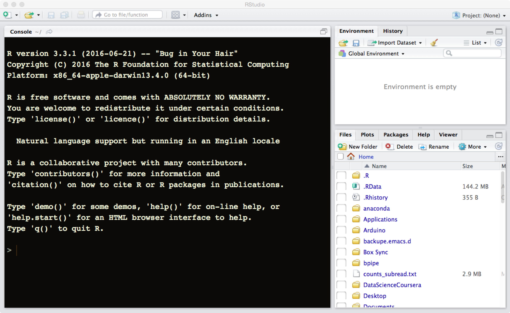

# Pre-course
There are few things to do and think about before the course starts. Please read carefully and follow the instructions so we can all have a good start to the course. Contact course organisers in case anything in unclear.

During the course we will be using Uppsala University's high performance computer (Uppmax) as well as run scripts locally on laptops using R and R-Studio. To be able to follow exercises we ask you to configure access to Uppmax and install both R and R-Studio on your laptop. Also, having IGV (Integrative Genomics Viewer) installed will come handy during the course.

# Uppmax
The computational resources are provided by SNIC_UPPMAX. To be able to use them
- create a user account (if you do not already have one)
- associate your user account with the course project we have created for the course

## if you are new to Uppmax: create user account and request membership in the course project g2017022
This involves few steps. Briefly,

1. registering at SUPR
2. accepting the User Agreement
3. becoming a member in a project (the one we have prepared for the course)
4. applying for an account at Uppmax

To go through the steps follow the instructions on [Uppmax website](http://www.uppmax.uu.se/support/getting-started/applying-for-a-user-account/). While at this keep this information handy:
- Cluster name: milou
- Project ID: g2017022

## if you are already on Uppmax (Milou): request membership in the course project g2017022
1. log in to [SUPR](https://supr.snic.se)
2. under Projects: Requesting Membership in Projects, request membership in g2017022

## everyone: check configuration
After you complete the above Uppmax setting-up steps
- login to milou.uppmax.uu.se
- type "id" in the command line
- copy and email back (course organisers) the output of the command

A guide explaining logging procedure can be found on [Uppmax website](http://www.uppmax.uu.se/support/user-guides/guide--first-login-to-uppmax/)

# R & R-Studio

For the course we will also use the latest version of R and R-studio locally. Both
of these work on computers running Linux, Windows and Macintosh
operative systems. R-studio is a set of tools as well as an editor
that facilitates the use of R and in many ways create a superior
environment to integrate directly with R. Over the last years it has
become a very popular tool and in many ways become a de-facto standard
for working with R.

Note that on same operative systems it will be easier to install and
run R and R-studio if you are administrator of your own computer and
hence are allowed to install software on your machine. If you do not
have these privileges please ask your system administrator to install
the latest version of R and R-studio.

## Install R

1.  Go to [CRAN](https://cran.rstudio.com)
2.  Click on the link corresponding to your operative system
3.  Download the recommended files for your system.
4.  Run the installer or move the downloaded files to suitable place on
    your computer.

### Details for Windows

Once you clicked on the "Download R for Windows" you will come to a
new web page where you will have a set of options. Click on the first
link named "base". This will take you to the web page entitled "R-3.3.3
for Windows" where you can download the "R-3.3.3-win.exe"
that will can be run to install R on your computer.

### Details for Macintosh

Once you clicked on the "Download R for Macintosh" you will come to a
new web page where you will have a set of options. Unless you have an
old version of your operative system you should select the first link
named "R-3.3.3.pkg" that will download R to your computer. If you are
not sure what version you are running click the apple on the top left
of your screen and select "About this mac" (Om den här datorn). In
case you are running something older than 10.9, you should instead
pick the "R-3.2.1-snowleopard.pkg" to install. Note that this will not
give you the latest version of R, but it will be sufficient for most
sections of the course.

You can then double-click the downloaded package that will prompt you
with some questions for installation details. Stick with the default
settings and you should be fine.

### Details for Linux

Once you clicked on the "Download R for Linux" you will come to a
new web page where you can select the linux version you use. On most
distributions this will be via a software install system like yum or
apt-get. If you run this make sure that you update your information to
the installer first, otherwise you might end up installing at outdated
version of R. For some systems you might need to install not only
r-base, but also r-devel or you will lack important features of your R
installation.

## Install R-studio

Go to the
web page [rstudio](https://www.rstudio.com/products/rstudio/download/)
download the installer corresponding to your operative system. Unpack
the installer and install the app on a suitable place on your system.

## Test installations

If the installation above went without any problem you should be able
to fire up R-studio and see something like the following:

If you do not see a screen like this one please send an email to
thomas.kallman@nbis.se describing the error as well which operative operative
system you are running.

# IGV
To install, follow the instructions on the [IGV website](http://software.broadinstitute.org/software/igv/)

# Useful things to try before the course
For those of you wanting to start ahead and/or brush up on various skills before the course

- [Unix](http://www.ee.surrey.ac.uk/Teaching/Unix/): especially the first three chapters. You can practice on Milou or using this [emulator](http://uppnex.se/emu/)
- [Best first R tutorial](https://www.nceas.ucsb.edu/files/scicomp/Dloads/RProgramming/BestFirstRTutorial.pdf)  
  A nice self learn tutorial to R, introducing many central concepts to R.
- [A short introduction to R](https://cran.r-project.org/doc/contrib/Torfs+Brauer-Short-R-Intro.pdf)  
  A very short introduction to using R.
- [Video introduction to ChIP-seq data analysis](https://www.youtube.com/watch?v=zwuUveGgmS0) by Dr. Carl Hermann, University of Heidelberg
- [DiffBind tutorial](https://bioconductor.org/packages/release/bioc/vignettes/DiffBind/inst/doc/DiffBind.pdf): introduction to Bioconductor package for differential binding that will be used during the course
- [ChIPpeakAnno tutorial](http://bioconductor.org/packages/release/bioc/vignettes/ChIPpeakAnno/inst/doc/pipeline.html): introduction to Biocondcutor package for downstream ChIP-seq data analyses that will be used during the course

# Useful online resources

- [Bioinformatics StackExchange](https://bioinformatics.stackexchange.com)
  Online questions and answers resource in bioinformatics
- [http://www.biostars.org/](http://www.biostars.org/)  
  Online question and answer resource in bioinformatics
- [http://seqanswers.com/](http://seqanswers.com/)  
  Online forum focusing on analysis of NGS data
- [Stackoverflow](http://stackoverflow.com)  
  Online community for programmers.
