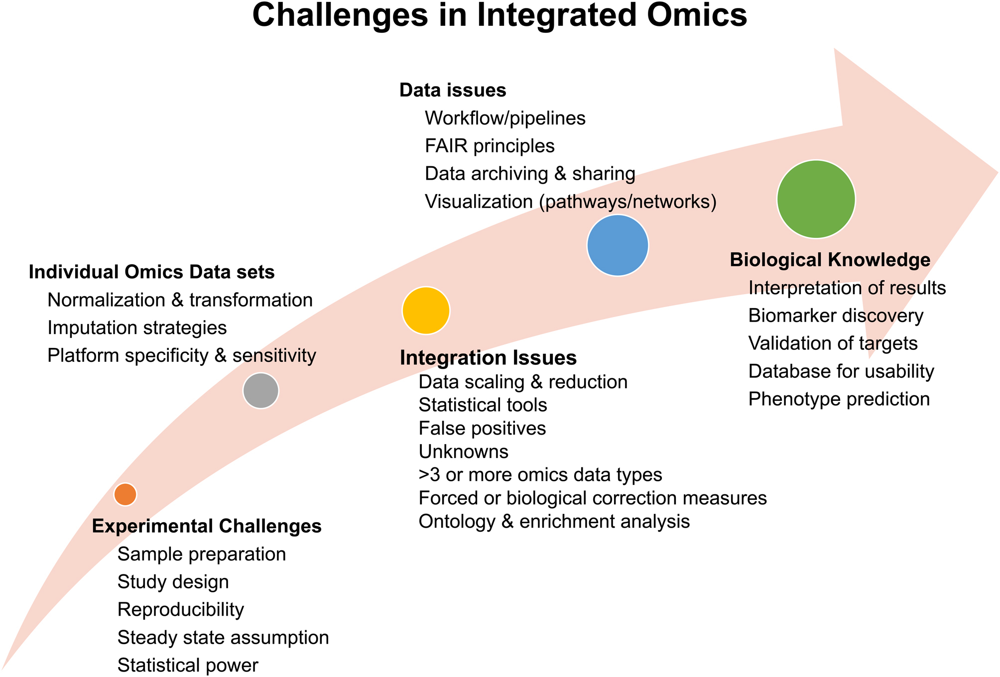
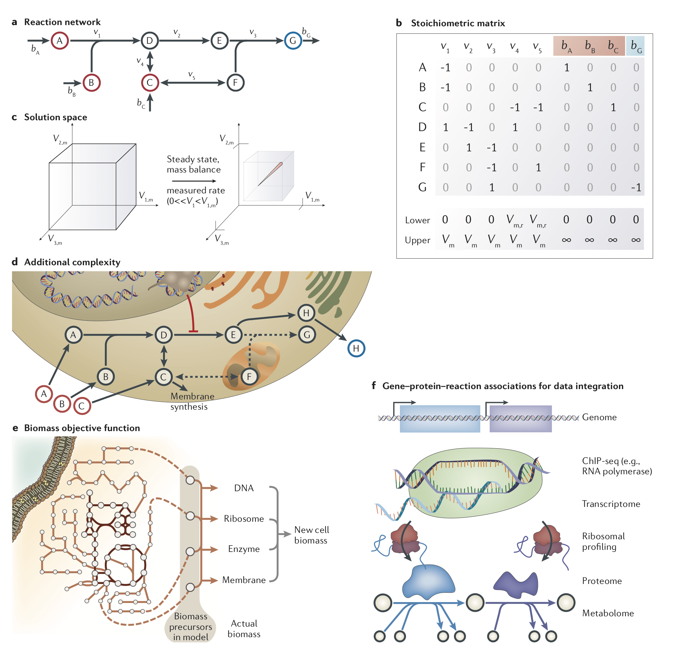
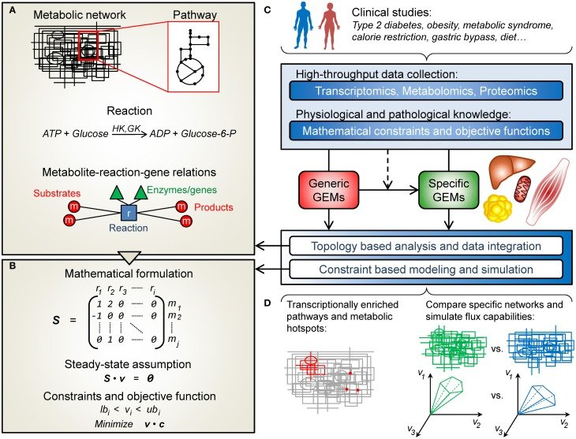
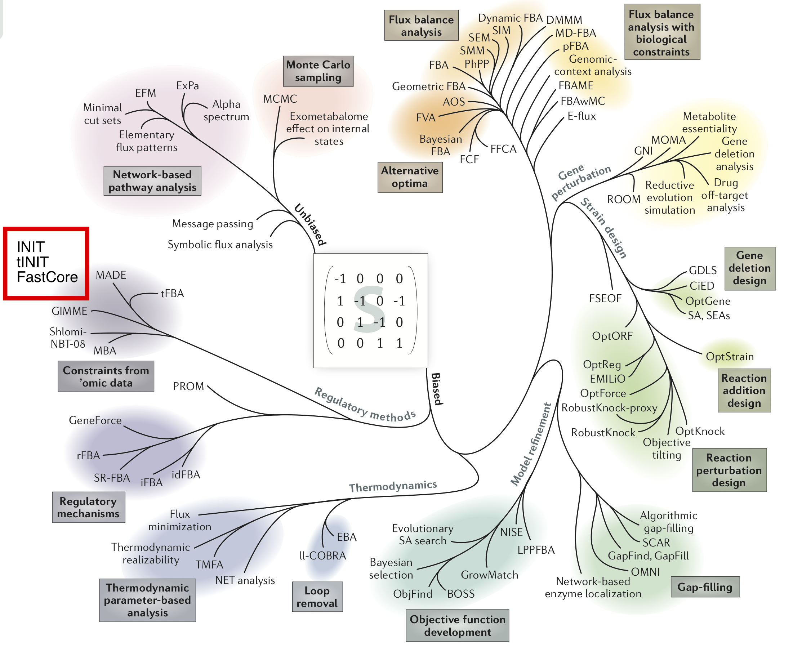
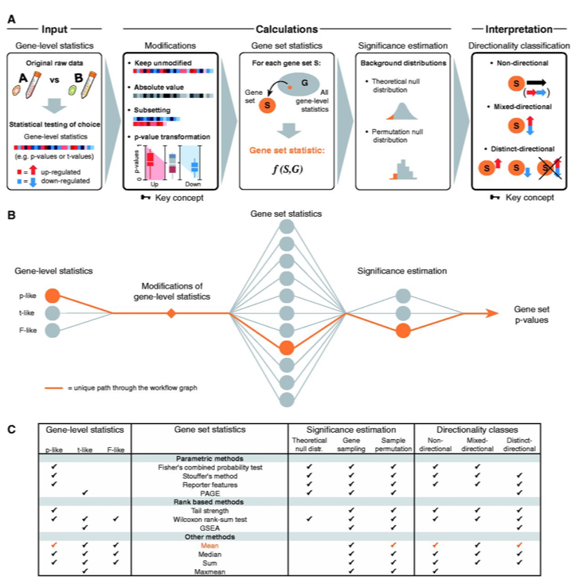

class: left, left, middle

## Omics Integration and Genome-Scale Metabolic Models ( a.k.a GEMs)

---

## Lecture and Tutorial Overview (Wednesday/Thursday)

 - Background
 
  - Views on Omics data Integration
  - Networks and models for data integration
  - Brief about Omics
  - Biological Networks
  
 - Genome Scale Metabolic Models
  - Introduction to GEMs
  - Models, Context Specific Reconstruction, Tools for analyses
  - Seminars on use of Metobolic Models and Human Metablic Atlas (Jonathan and Mihail)
 
 - GEMs as Network
  
  - Gene Sets and Enrichment
  - PIANO package R (Practical)
  - MultiAssayExperiment (From Data management)

 - Data Visulazation 
  - Circos Plot from HMR and Piano Output
  - Visualize results with HMR
  - Hive plot (Optional), Cytoscape from R (Optional)

---
## Omics Data Integration

 - *Creative work* in bioinformatics.  
 
 - Combine data, find shared and distinct information information.  
 
 - We learn tools and ways of working with different types of data (Venn diagram's anyone?)  
 
 - Interpretation and apllication depeneds on the study questions  
 - More data -> More tools -> More complexity (Redundancy, contradictions)  
 - Needs across disciplinary communication  
 
 - Clever visualizations lead to impact, **poor visulaizations = less impact**, No visulization = Hardly any impact. Big impact papers these crap a lot of data into complex figures. 
  
 - Many tools and approaches, guideline only for specific purposes. ***More Resposibility on the analyst to document analyses  pipelines.***

???

_Spend Five minutes_.

---
## A Network or a Model View on of Data Integration 

 - **Biological processes do not work alone in isolation**
 
 - **We know alot about how these molecules work together or in Isolation**
 
 - **Networks and Models allow us to represent *molecule-to-molecule* relationship**
 
 - **They allow us to perform calculations and visulaize data in the conext of our measurements**
 
 - **We can speak to biologists/clinician (often not easy)**
 
 - **Provide visualization that allow comminication (or some times does not communicate anything at all)**
 
 - **Help integrate and contextualize different *Omics* data and find overlaps or relatioships between them.**

---
## Short perspective on Omics measurements

 - **Omics measurements are fundamentally different due to technical reasons**
  - Sequencing techniques vs. mass spectrometry based technologies have different   
  dynamic range and measurement space. 
  - Itnesities do not alwasy correspond to actual amount in the sample. This makes global normalization tricky.
  - Same samples measure after a period of time does not correspond to same values. 
   

 - **Different Omics measure fundamentally different aspects of biology**
  - A classic example is *Phosphoproteomics* where proetins are present in very small amounts but just a modification cane lead to activity.
  - Obviosuly measuering omics in blood vs. tissue have different intepretations and would need a lot of testing. 

 - **Some times (in fact most of the time) it is best to stattically analyse omics data with respective pipelines and then try ti Integrate them.**
  - Add followup *lookups* or statistical test for association/correlations. **Meta Analyses**
  - Rather rely on visulaizations that communicate with the audience you are interested in.
  
 - **Avoid strict cut-offs and binning of the data just based on p-values when comparing different Omics**
---
## Brief about challenges in Omics-integration

A comprehensive overview of tools for omics integration ([Misra et al](https://jme.bioscientifica.com/view/journals/jme/62/1/JME-18-0055.xml)). One cannot stress enough the need for reproducibilty in a science at juvenile stage.

---
class: left, middle, middle

## Five-to-Ten Minutes Discussion about  
 - Questions about 
 - Persepctives on Omics integration  
 - Challenges you face.

---

## Introduction to Genome Scale models  

- **Genome Scale Models**
 - Background and resources
 - Recontruction
 
- **Types of GEMs**
  - Large: RECON3D and HMR
  - Small: Microbial (Yeast, E.Coli)  
  
- **Tools COBRA/RAVEN**
  - Construction, buliding models.
  - FVA, FBA, Simulations
  - Gene essentialy analyses
  - Data integration and Large Network Construction  
  - *Network Reconstruction*
  - *Visualize parts of the netwrok*
  - *Topological analyses*

???

_Notes_.

---
class: inverse, left, middle
## What are Genome scale metabolic models (Gems)

.pull-left-50[
- Genome-scale metabolic models (GEMs) are mathematical reconstructions of the metabolic networks with all known metabolic reactions. of many kinds of cells, including those of microorganisms, plants, and mammals. 

- In some cases, GEMs could represent the whole tissue or body of a multicellular organism.

- In these metabolic networks, the gene-protein-reaction (GPR) relationships are annotated. 

- In addition, all the reactions in GEMs are mass-balanced, ensuring stoichiometric balance.

]

.pull-right-50[

]

---
## Fundametals of Genome Scale Metabolic Modelling

**Metabolic reconstruction:**

A carefully curated and biochemically validated knowledge base in which all known chemical reactions for an organism are detailed and catalogued.

**Genome-scale model**
A condition-specific, mathematically described, computable derivative of a metabolic reconstruction, containing comprehensive knowledge of metabolism.

**Solution space:**
The feasible region satisfying a set of constraints. In constraint-based reconstruction and analysis (COBRA) models, this represents the feasible flux values for all of the reactions in the model.

**Flux distributions**

A set of steady-state fluxes for all of the reactions in a metabolic network. 

**Linear programing and Objective function**

A mathematical optimization technique that determines a way to maximize a particular linear objective under a given set of conditions. Typically used in flux balance analysis, in which the objective is often the biomass function (growth) and the constraints represent the growth conditions.

_Notes_.

---
## Why GEMs in Omics integration

- (GEMs): a valuable systems biology platforms for 
  - model-guided data analysis of large omics datasets
  - provide cellular context to the data 
  - allow the integration of diverse omics data 
   - since they catalog all metabolic reactions in an organism, and the reactionsdirectly link metabolites to enzymes.

- Elucidate how changes in one component affect other pathways and cell phenotypes since these models connect genes to measurable cell phenotypes 
  - growth, cell energetics 
  - pathway fluxes 
  - biosynthesis of cell components, byproduct secretion, etc.
  - Thus, these systems biology models can provide a mechanistic link from genotype to phenotype

  
  

*Cell Systems 4, 318–329, March 22, 2017*

---
## An overview of human genome scale metabolic models (GEMs) and their applications in Clinical Science

---

---

# Phylogeny of COBRA/RAVEN toolbox

_[There exists a plethora of tools to create an analyze GEMs]_.

---
## RAVEN 2

???

_Notes_.
RAVEN was significantly enhanced for de novo draft model reconstruction by integrating knowledge from different sources (e.g. KEGG and MetaCyc). It has better import/export support to relevant formats, and especially improved compatibility with the COBRA Toolbox by resolving previously conflicting function names and providing a bi-directional model conversion function. As a MATLAB toolbox, RAVEN provides one unified environment for both model reconstruction and simulation analysis (e.g. FSEOF) and allows scripting for more flexible operations.
---

## Model Extraction Algorithms

---
## The performance of model extraction algorithms and parameter 

Different parameters and algorithms yielded diverse models

Extraction method most strongly affected accuracy of gene essentiality predictions
---
## Context Specific Models based on iMAT Algorithm.
** The number of reactions active in given pathways.**

---
## Flux distribution across samples specific models.

---
## Analyses of functionalities based on gene expression data with diferent algorithms.

A comparison of reconstructions using different Algorithms and their functionalities.  

.pull-left[

]

.pull-right[
 - Essentially the parameters algorithms use to create context specific models explain the largest variation in your data.
 
- More relevant is perhaps knock-down experiments and back calculate the flux distributions and/or model functionalities.

- We will only cover Reaction Enrichment in Piano that one can follow up using HMR and RANVE/COBRA.
]
---
## Matlab Demonstration

 - Unfortunately the Constaint Based modelling is only available in MATLAB.
We decided against going into modelling with MATLAB as hands on but will intoduce you to how it works.

 - Show in matlab the Human metabolic models and the element.
  - HMR and RECON3
  - ExcelModel

 - Describe the functionality of algorithms in the toolboxes.

 - createTissueSpecificModel
 - getINITModel

 - Explain the Excel model format.
 

---

## HMR as a Network and gene set Enrichment Analyses

Signalling, Coexpression, metabolic, Protein Protein Interaction, Phosphoproteins etc

 - Netwrok representation
  - Gene-metebolite
  - reaction associations
  - Reaction- Pathway associations
  
 - **Piano Package in R**
  
  - Implements several different methods for gene set enrichment analyses.
  - Provides direct comparison of several methods and allow building a consensus on enrichment analyses.
  - Allow direction specific analyses
  - Provides excellent visualization of result.
  - Easy output/export of results for further analyses.
  
 
 
 *Nucleic Acids Research, Volume 41, Issue 8, 1 April 2013, Pages 4378–4391*
---
## Piano workflow

.pull-right-size-20[
Nucleic Acids Research, Volume 41, Issue 8, 1 April 2013, Pages 4378–4391
]

???
_Notes_.
Figure 1.  Overview of the refined GSA workflow. ( A ) The key steps in the workflow. Starting from user-defined gene-level statistics, and their possible modifications, gene set statistics are calculated according to the 11 available methods. Significance of the gene sets is estimated based on a theoretical null distribution or a permutation approach. The final gene set P -values will be separated into the defined directionality classes, facilitating the interpretation step. ( B ) A graph representation of our GSA workflow. Each path through the graph corresponds to a unique run of the GSA. The nodes represent the number of settings that can be made at each step. The resulting directionality classes depend on the combination of settings made. ( C ) Not all paths, or combinations of settings, are allowed. The table shows which settings are possible for each gene set statistic method. The highlighted settings correspond to the highlighted path in B and will result in two of the three possible P -value classes

---
## The PIANO Totorial/Exercice

 - Create gene Sets from HMR network.
  - Gene-Pathway gene set
  - Gene-reaction gene sets
  - Gene Pathways Gene sets
  
 - Prepare data for Piano's ´runGSA´ function and run it.
  - Gene-stats (p-values)
  - Gene-Sets
  
 - Explore the results in the web too and write the output files.
 
 - Explore diffrent functionalities in Piano to run consensus analyses. 
 
 - We can discuss the results and inerpretations.
  
  
