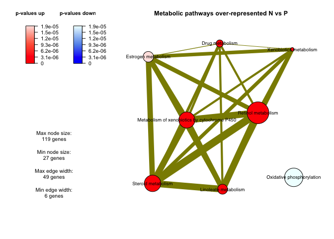

Untitled
================

# Topological analyse with Piano Piano package

1)  Create the gene sets from Human metabolic network (HMR)

<!-- end list -->

  - Gene Pathway association file
  - Gene Reaction associations
  - Gene Mtabolite associations

<!-- end list -->

2)  Organize the data and run Piano

<!-- end list -->

  - load differential gene experession files and gene-sets
  - Prepare data for Piano
  - Run GSA

<!-- end list -->

3)  Explore and save the results

<!-- end list -->

  - explore the networks and tables
  - write output (tables and networks) from Piano for future use

<!-- end list -->

``` r
suppressMessages(library(readr))
suppressMessages(library(tidyverse))
suppressMessages(library(piano))
suppressMessages(library(BiocParallel))
suppressMessages(library(DESeq2))
#excelRxns <- read_delim("/Users/cob-aaf/Documents/GitHub/Omics_int/workshop_omics_integration/session_gems/Data/excelRxns.txt",    "\t", escape_double = FALSE, trim_ws = TRUE)
```

Gene Set Enrichment analyses requires three basic componenets, 1)
Summary statitics from your own data, 2) Gene Sets you maybe intereste
in and 3) the tool/ algorithmn (in this case Piano).

For this tuttorial we need three data files.

1)  The file “excelRxns.txt” is the excel representation of HMR (Human
    metabolic network). It is a good idea to explore each of the columns
    to see what they represent.We will use this text representation to
    build our own Gene sets.

2)  “HMR\_Gene\_Sets.RDS” contains list of gene sets that we create from
    the file in step 1. You should in principle get your own Gene sets
    fro the step 1. But if you cannot manage to create your own gene
    sets, you can load this file to work on the next steps.

3)  “DiffenrentiallyExpressed.RDS” containing statitics for
    differentially expressed genes from an RNA-seq
experiment.

<!-- end list -->

``` r
excelRxns <- read_delim("Data/excelRxns.txt", "\t", escape_double = FALSE, trim_ws = TRUE)
```

    ## Parsed with column specification:
    ## cols(
    ##   `#` = col_logical(),
    ##   ID = col_character(),
    ##   NAME = col_logical(),
    ##   EQUATION = col_character(),
    ##   `EC-NUMBER` = col_character(),
    ##   `GENE ASSOCIATION` = col_character(),
    ##   `LOWER BOUND` = col_double(),
    ##   `UPPER BOUND` = col_double(),
    ##   OBJECTIVE = col_logical(),
    ##   COMPARTMENT = col_logical(),
    ##   MIRIAM = col_logical(),
    ##   SUBSYSTEM = col_character(),
    ##   `REPLACEMENT ID` = col_logical(),
    ##   NOTE = col_logical(),
    ##   REFERENCE = col_character(),
    ##   `CONFIDENCE SCORE` = col_double()
    ## )

``` r
Gene_sets<-readRDS("Data/HMR_Gene_Sets.RDS")
res_HMR<- readRDS("Data/DifferentiallyExpressed.RDS")
```

## Create Gene Sets

There are four main components of a metbolic network. 1) Genes, 2)
Metabolites, 3) Reactions an 4) pathways. As wer are interested in using
gene-based analyses (RNA-seq) we want to creat gene sets where
indicating their relationships with metabolites, reactiosn or pathways.

We will begin by creating our own gene sets from the
gene-metabolite-reaction-pathway links from the genome scale metabolic
network. Genome Scale Metabolic network is probably one of the best
curated gene sets available. The other notable well curated networks
include Signalling Network, regulatory networks and protein protein
interaction
network.

## Gene-Reaction associations

``` r
#excelRxns <- read_delim("/Users/cob-aaf/Documents/Courses/Multiomics/Data/excelRxns.txt",    "\t", escape_double = FALSE, trim_ws = TRUE)

HMR_Network<-excelRxns %>% dplyr::select(ID, `GENE ASSOCIATION`, SUBSYSTEM, EQUATION)
# 
l<-HMR_Network$`GENE ASSOCIATION` %>% str_split(pattern = "or|and")
names(l)<-HMR_Network$ID
l<-l[!is.na(l)]

l1<-rep(lapply(l, length))

df_1<-data.frame(trimws(unlist(l)), rep(names(l), l1)) 
Gene_reaction_HPR_Gsc<-loadGSC(df_1)
```

# Gene-pathways Gene Sets

``` r
l<-HMR_Network$`GENE ASSOCIATION` %>% str_split(pattern = "or|and")
names(l)<-HMR_Network$SUBSYSTEM
l<-l[!is.na(l)]

l1<-rep(lapply(l, length))

df_2<-data.frame(trimws(unlist(l)), rep(names(l), l1)) 

Gene_Pathway_HMR<-loadGSC(df_2)
```

# Gene reaction Equation

``` r
l<-HMR_Network$`GENE ASSOCIATION` %>% str_split(pattern = "or|and")
lx<- HMR_Network$EQUATION

names(l)<-lx
l<-l[!is.na(l)]
l1<-rep(lapply(l, length))

df_3<-data.frame(trimws(unlist(l)), rep(names(l), l1)) 
Gene_metabolite_HMR<-loadGSC(df_3)
```

# And Finally the Gene-metabolite association from the equation

This part is a littel bit more complicated and involves a bit of text
manipulation. Just follow each command and have a look at the output to
try and understand what these commands did. It is fine if you dont
understand some of it. The gene-metabolite gene-set is provided as
indicated above.

``` r
# Gene Metabolite
l<-HMR_Network$`GENE ASSOCIATION` %>% str_split(pattern = "or|and")

lmm<-HMR_Network$ID
lx<-HMR_Network$EQUATION %>% str_split(pattern = "[=>]|[+]|[<=>]")

names(lx)<-lmm


l1<-rep(lapply(lx, length))

df_4<-data.frame(trimws(unlist(lx)), rep(names(lx), l1)) 


names(df_4)<- c("metabolite", "reaction")
names(df_1)<-c("gene", "reaction")
Gene_reaction_metabolite<- merge(df_1,df_4, by = "reaction")
discard<- Gene_reaction_metabolite[(nchar(as.character(Gene_reaction_metabolite$metabolite))<7),]$metabolite %>% sort(decreasing = T)
Gene_reaction_metabolite<-Gene_reaction_metabolite[(nchar(as.character(Gene_reaction_metabolite$metabolite))>6),]
gene_metabolite<-Gene_reaction_metabolite[, c("gene","metabolite")]

Gene_metabolite_gsc<-loadGSC(gene_metabolite)
```

Now that we have all the gene sets we need, we can save thses for future
use.

``` r
GSS_for_pian<-list(Gene_reaction_HPR_Gsc, Gene_Pathway_HMR, Gene_metabolite_HMR, Gene_metabolite_gsc)
names(GSS_for_pian)<-c("Gene_Reaction", "Gene_Pathway", "Gene_equation", "Gene_Metabolite")
#saveRDS(GSS_for_pian, "Data/HMR_Gene_Sets.RDS")
```

Note that these gene sets can easily be gene sets available from any of
the datbases, e.g., GSEA. We just wanted to create our own sets to make
sure that we have some control over gene sets we want to use serving our
biological question. It is important to realize that performing gene set
enrichment analyses of very large irrelevant gene sets may lead to
spurious results. Therefore, it is importnat to thing what gene sets
should be used that are relevant for biological questions. Here we aim
to undersdtand what metabolic chnaged may be associated with
differnetial expression in our experiment.

# Gene stats

In addition to the gene sets above, we can us different summary
statitics such as p-valuse and fold changes.

``` r
myPval<- res_HMR$padj
names(myPval)<-rownames(res_HMR)
myFC<-res_HMR$log2FoldChange
names(myFC)<-rownames(res_HMR)
direction<-ifelse(myFC>0, 1,-1) # The dircetion of regulation is an important distinction in Piano that helps contextualize results.
gene_stats<-cbind(myPval,myFC, direction)
```

# runGSA founction to identify enriched pathways.

Use help to undersatnd the runGSA function better and see what sort of
paremeter one can use for different kinds of
statitics.

``` r
reporter_npr_pathways<-runGSA(geneLevelStats = gene_stats[,"myPval"], directions = gene_stats[,"direction"], gsc=Gene_sets$Gene_Pathway, geneSetStat="reporter", signifMethod="nullDist", nPerm=1000, gsSizeLim=c(5,500))
```

    ## Running gene set analysis:

    ## Checking arguments...done!

    ## Final gene/gene-set association: 2222 genes and 116 gene sets

    ##   Details:

    ##   Calculating gene set statistics from 2222 out of 3471 gene-level statistics

    ##   Removed 322 genes from GSC due to lack of matching gene statistics

    ##   Removed 1 gene sets containing no genes after gene removal

    ##   Removed additionally 20 gene sets not matching the size limits

    ##   Loaded additional information for 0 gene sets

    ## Calculating gene set statistics...done!
    ## Calculating gene set significance...done!
    ## Adjusting for multiple testing...done!

``` r
#exploreGSAres(reporter_npr_pathways)
```

``` r
reporter_npr_reactions<-runGSA(geneLevelStats = gene_stats[,"myPval"], directions = gene_stats[,"direction"], gsc=Gene_sets$Gene_Reaction, geneSetStat="reporter", signifMethod="nullDist", nPerm=1000, gsSizeLim=c(1,500))
```

    ## Running gene set analysis:

    ## Checking arguments...done!

    ## Final gene/gene-set association: 3372 genes and 7323 gene sets

    ##   Details:

    ##   Calculating gene set statistics from 3372 out of 3471 gene-level statistics

    ##   Removed 322 genes from GSC due to lack of matching gene statistics

    ##   Removed 75 gene sets containing no genes after gene removal

    ##   Removed additionally 0 gene sets not matching the size limits

    ##   Loaded additional information for 0 gene sets

    ## Calculating gene set statistics...done!
    ## Calculating gene set significance...done!
    ## Adjusting for multiple testing...done!

``` r
reporter_npr_metabolites<-runGSA(geneLevelStats = gene_stats[,"myPval"], directions = gene_stats[,"direction"], gsc=Gene_sets$Gene_Metabolite, geneSetStat="reporter", signifMethod="nullDist", nPerm=1000, gsSizeLim=c(1,500))
```

    ## Running gene set analysis:

    ## Checking arguments...done!

    ## Final gene/gene-set association: 3217 genes and 6786 gene sets

    ##   Details:

    ##   Calculating gene set statistics from 3217 out of 3471 gene-level statistics

    ##   Removed 273 genes from GSC due to lack of matching gene statistics

    ##   Removed 67 gene sets containing no genes after gene removal

    ##   Removed additionally 0 gene sets not matching the size limits

    ##   Loaded additional information for 0 gene sets

    ## Calculating gene set statistics...done!
    ## Calculating gene set significance...done!
    ## Adjusting for multiple testing...done!

## Extract Significan

Use R help to undertand
    GSAsummaryTable()

### Create and save network plot to files or view interactively.

    ## -------------------------------------------------------------------------------
    ## 
    ##   A newer function 'networkPlot2()' with the same purpose is now available!
    ## 
    ## -------------------------------------------------------------------------------

<!-- -->

    ## null device 
    ##           1

Further look in into Piano packag functionalities from the Vignette and
play with the above functions to explore the data.

``` r
#browseVignettes("piano")
```

# Export Piano results for further network analyses.

Finally we will write the network files from your results that can be
explored. Kiwi is another algorith developed by one of NBIS superstars
(Leif Varemo Wigge), we donot go into that in this course. We will use
some of these for our visualizations.

``` r
#setwd("~/Documents/Courses/Multiomics/Data/Piano_Results")
#writeFilesForKiwi(reporter_npr_pathways, label = "Pathways",overwrite = TRUE)
#writeFilesForKiwi(reporter_npr_reactions, label = "Reactions", overwrite = TRUE)
#writeFilesForKiwi(reporter_npr_metabolites, label = "metabolites", overwrite = TRUE)
```
