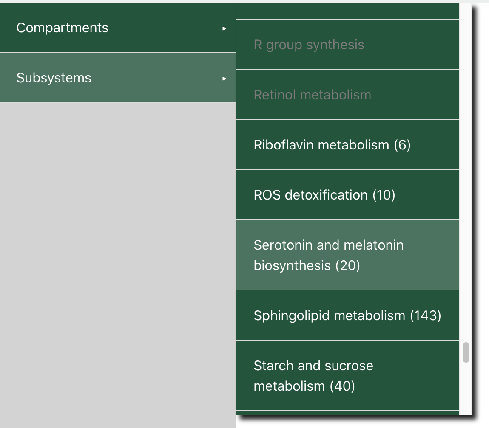
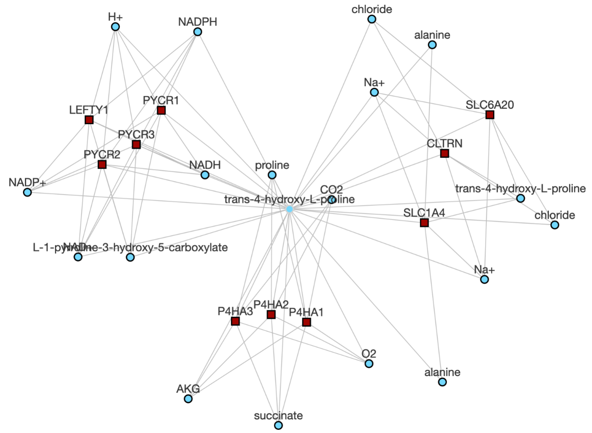
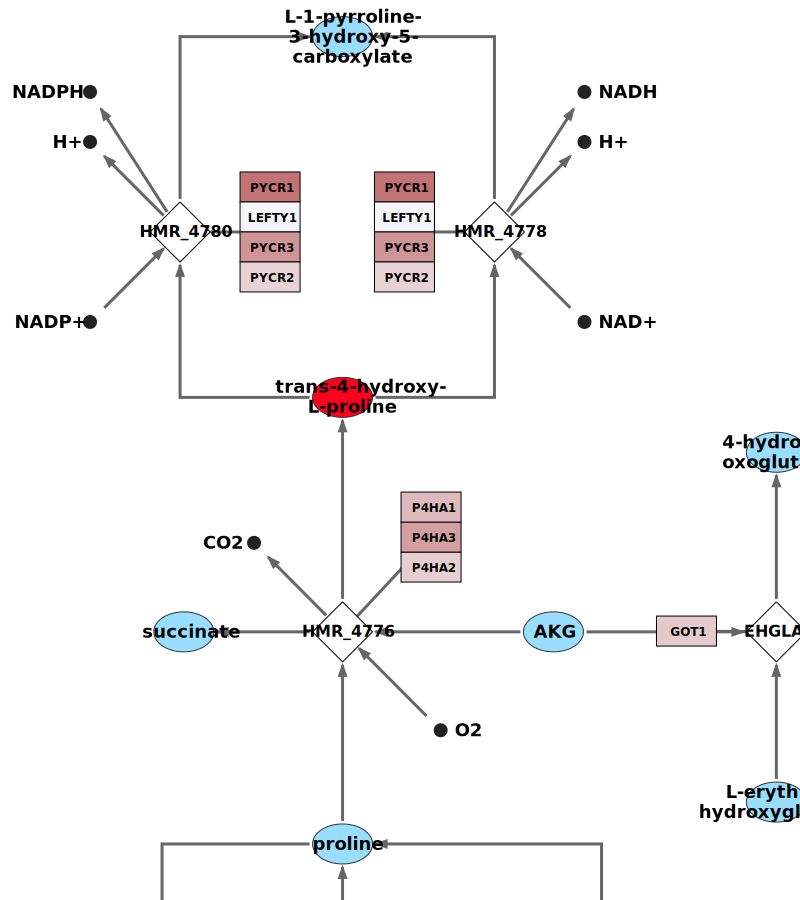

<style type="text/css">

blockquote {
  background: #ECF8FF;
  border-left: 10px solid #3989CB;
  margin: 1.5em 10px;
  padding: 0.5em 10px;
  font-size: 14px;
}

h1 { 
  font-size: 25px;
  margin-top: 1.5cm;
  margin-bottom: 0.5cm;
}
h2 { 
  font-size: 18px;
  margin-top: 1cm;
  margin-bottom: 0.5cm;
}
h3 {
  font-size: 14px;
  margin-top: 1cm;
  margin-bottom: 0.5cm;
}

table.answer, td.answer {
   border: 0px;
   background: #BCE0C0;
   padding: 10px;
   width: 100%;
}

div.answer { display: true;}

</style>

```{r setup, include=FALSE}
knitr::opts_chunk$set(echo = TRUE)
#If you want to knit the whole notebook, please specify below correct path to the Rmd-file
knitr::opts_knit$set(root.dir="/home/jovyan/lab")

### be sure to update the environment name if applicable
library(reticulate)
reticulate::use_condaenv('GEM_GSA_env')
knitr::opts_chunk$set(echo=T, tidy=F, eval=T, cache=F)
qn <- sn <- 0

setwd("/home/jovyan/lab")
```

Introduction
============

Gene set analysis (GSA), or alternatively gene set enrichment analysis (GSEA), is a commonly used approach for interpreting omics data, whereby genes are aggregated into groups (gene sets) on the basis of their shared biological or functional properties. The aim of GSA is to interpret biological phenomena (the "how"), and from that, generate a hypothesis for the underlying mechanism (the "why"). These hypotheses can then be validated in replication studies and other independent laboratory experiments.

Genome-scale metabolic models (GEMs) are a computational representation of the chemical reactions that comprise the metabolic network of an organism or biological system. A valuable feature of GEMs is their connectivity information, such as gene-reaction, reaction-metabolite, and reaction-pathway associations. In this exercise, we will demonstrate how this connectivity information can be used to interpret transcriptomic data in the context of metabolism. Specifically, gene-metabolite and gene-pathway connections derived from [Human-GEM](https://github.com/SysBioChalmers/Human-GEM) will be used to identify regions of the human metabolic network that are significantly associated with trancriptional changes in tumors.

For this exercise we will use publically available RNA-Seq data from [The Cancer Genome Atlas](https://portal.gdc.cancer.gov/) (TCGA) database, specifically from the [Breast Invasive Carcinoma](https://portal.gdc.cancer.gov/projects/TCGA-BRCA) (BRCA) project.

</br>

```{r, echo=FALSE, fig.cap='*Image from US National Cancer Institute GDC Portal homepage (portal.gdc.cancer.gov)*', out.width = '85%', fig.align='center'}
knitr::include_graphics('assets/tcga_gdc_banner.png')
```


Setup option 
=====

**In r/rmarkdown run the following code**

`r sn<-sn+1; paste0(sn,"\\. ")` If your docker installation fails, navigate to the directory where "renv.lock" file is located and run following code chunk.

</br>

**In R Studio**

`r sn<-sn+1; paste0(sn,"\\. ")` Load the R packages that will be used in this exercise
```{r, message=FALSE, warning=FALSE, results='hide'}
# downloading and processing TCGA data
library(TCGAbiolinks)
library(SummarizedExperiment)

# differential expression anaylsis
library(edgeR)

# gene set (enrichment) analysis
library(fgsea)
library(piano)

# plotting
library(viridisLite)
library(ggplot2)
library(gridExtra)
library(pheatmap)
library(RColorBrewer)

# misc
library(tibble)
library(org.Hs.eg.db)
```
</br>

Retrieve RNA-Seq data
=====================

> **Note:** This and the **Differential expression analysis** section below are **optional**! If the GDC or Ensembl database is slow/unavailable, or you are comfortable with differential expression analysis, you can skip ahead to the **Gene set analysis** section below. The processed count matrix and differential expression analysis result files are already available in the `data/TCGA_data/` directory.

```{r, echo=F}
RunAll <- F  # in case we don't want to re-run the TCGA data retrieval and DE analysis (quite slow)
```

`r sn<-sn+1; paste0(sn,"\\. ")` Query the TCGA database (hosted by GDC). Specifically, we are querying for RNA-Seq gene counts associated with the breast cancer project, and filtering to include only sample types `Primary Tumor` and `Solid Tissue Normal`.
```{r, message=F, warning=F, eval=RunAll}
query <- GDCquery(project='TCGA-BRCA',  # breast cancer
                  data.category='Transcriptome Profiling',
                  data.type='Gene Expression Quantification',
                  experimental.strategy='RNA-Seq',
                  workflow.type='STAR - Counts',
                  sample.type=c('Primary Tumor', 'Solid Tissue Normal'))
```
</br>

`r sn<-sn+1; paste0(sn,"\\. ")` For simplicity, identify subject IDs that are associated with exactly 1 normal and 1 tumor sample
```{r, eval=RunAll}
# Identify subjects with paired data
q <- getResults(query)
paired_subjects <- intersect(q$cases.submitter_id[q$sample_type == 'Primary Tumor'],
                             q$cases.submitter_id[q$sample_type == 'Solid Tissue Normal'])

# extract barcodes associated with those subjects
keep <- unlist(lapply(paired_subjects, function(x) sum(q$cases.submitter_id %in% x) == 2))
barcodes <- q$cases[q$cases.submitter_id %in% paired_subjects[keep]]
```
</br>

`r sn<-sn+1; paste0(sn,"\\. ")` Update our query, now filtering samples to include only those in our list of barcodes
```{r, message=F, warning=F, eval=RunAll}
query <- GDCquery(project='TCGA-BRCA',  # breast cancer
                  data.category='Transcriptome Profiling',
                  data.type='Gene Expression Quantification',
                  experimental.strategy='RNA-Seq',
                  workflow.type='STAR - Counts',
                  sample.type=c('Primary Tumor', 'Solid Tissue Normal'),
                  barcode=barcodes)  # specify sample barcodes
```
</br>

`r sn<-sn+1; paste0(sn,"\\. ")` Download count data. The data will be stored in separate folders for every sample, with very non-human-friendly names (take a look into the directory to see for yourself...).
```{r, message=F, warning=F, results='hide', eval=RunAll}
GDCdownload(query, directory=tcga_dir)
```
</br>

> **Note**: Even though we specify the directory `tcga_dir` where we want the files to be downloaded, it will still place a `MANIFEST.txt` file in your current working directory. You can just delete that file.

`r sn<-sn+1; paste0(sn,"\\. ")` Load the RNA-Seq gene counts from the downloaded files.
```{r, message=F, warning=F, results='hide', eval=RunAll}
# loaded as a "SummarizedExperiment" object
# TCGAdata <- GDCprepare(query, directory=tcga_dir)

# If that fails (i.e., Ensembl unavaiable)
TCGAdata <- readRDS(file.path(tcga_dir, 'TCGAdata.rds'))
```
</br>

`r sn<-sn+1; paste0(sn,"\\. ")` Further filter the data to only include subjects with the Luminal B subtype (`LumB`) of breast cancer
```{r, message=F, warning=F, results='hide', eval=RunAll}
meta <- colData(TCGAdata)
keep_subjects <- meta$patient[meta$paper_BRCA_Subtype_PAM50 %in% 'LumB']
TCGAdata <- TCGAdata[, meta$patient %in% keep_subjects]
```
</br>

`r sn<-sn+1; paste0(sn,"\\. ")` Extract the relevant fields from the `TCGAdata` SummarizedExperiment object
```{r, message=F, warning=F, results='hide', eval=RunAll}
counts <- assay(TCGAdata)
gene_symbols <- rowData(TCGAdata)$external_gene_name
subject_id <- as.factor(TCGAdata$patient)

# We explicitly state the ordering of the levels for sample_type as healthy -> diseased so that
# it uses this order for the differential expression analysis below.
sample_type <- factor(TCGAdata$sample_type, levels=c('Solid Tissue Normal', 'Primary Tumor'))
```
</br>

`r sn<-sn+1; paste0(sn,"\\. ")` Clear some intermediate variables to free some memory
```{r, eval=RunAll}
rm(TCGAdata, query, q)
invisible(gc())
```


Differential expression analysis
================================

> **Note**: The differential expression (DE) analysis here will be performed using the **edgeR** package. Since the focus of this workshop is not on DE analysis, we don't provide much detail surrounding the commands below. However, you can find a lot of examples and detail in the very helpful edgeR [User's Guide](https://bioconductor.org/packages/release/bioc/vignettes/edgeR/inst/doc/edgeRUsersGuide.pdf). Another excellent tool for DE analysis is **DESeq2**, which also has a fantastic [User Guide](https://bioconductor.org/packages/release/bioc/vignettes/DESeq2/inst/doc/DESeq2.html).

`r sn<-sn+1; paste0(sn,"\\. ")` Create DGEList object from the gene counts matrix
```{r, eval=RunAll}
y <- DGEList(counts=counts)
```
</br>

`r sn<-sn+1; paste0(sn,"\\. ")` Generate a design matrix such that samples are paired by subject ID
```{r, eval=RunAll}
design <- model.matrix(~subject_id + sample_type)
rownames(design) <- colnames(y)
```
</br>

`r sn<-sn+1; paste0(sn,"\\. ")` Filter low-count genes
```{r, eval=RunAll}
keep <- filterByExpr(y, design=design, min.count=10)
counts <- counts[keep, ]
y <- y[keep, , keep.lib.sizes=F]
gene_symbols <- gene_symbols[keep]
```
</br>

`r sn<-sn+1; paste0(sn,"\\. ")` Calculate normalization factors, and estimate dispersion
```{r, eval=RunAll}
y <- calcNormFactors(y)
y <- estimateDisp(y, design)  # calc time is ~1 minute
```
</br>

`r sn<-sn+1; paste0(sn,"\\. ")` Fit a generalized linear model (GLM) to the data and test for DE genes
```{r, eval=RunAll}
fit <- glmQLFit(y, design)
qlf <- glmQLFTest(fit)
topTags(qlf)  # view top DE genes
```
</br>

`r sn<-sn+1; paste0(sn,"\\. ")` Extract results table and add FDR-adjusted p-values
```{r, eval=RunAll}
res.table <- qlf$table
res.table$FDR <- p.adjust(res.table$PValue, 'BH')  # BH = Benjamini-Hochberg method
res.table <- cbind(gene_symbols, res.table) %>% rownames_to_column(var='gene')
```
</br>

`r sn<-sn+1; paste0(sn,"\\. ")` View the top DE genes again, this time with the gene symbols added to the table
```{r, eval=RunAll}
res.table[order(res.table$FDR)[1:10], c('gene_symbols', 'logFC', 'logCPM', 'PValue', 'FDR')]
```
</br>

`r sn<-sn+1; paste0(sn,"\\. ")` Export filtered count matrix and DE results to a plain text file
```{r, eval=RunAll}
colnames(counts) <- paste(c('normal', 'tumor')[sample_type], as.numeric(subject_id), sep='.')
counts <- rownames_to_column(as.data.frame(counts), var='gene')
write.table(counts, file=file.path(tcga_dir, 'count_matrix.txt'), quote=F, sep='\t', row.names=F)
write.table(res.table, file=file.path(tcga_dir, 'DE_results.txt'), quote=F, sep='\t', row.names=F)
```
</br>

`r sn<-sn+1; paste0(sn,"\\. ")` Also calculate median counts per million (CPM) for each sample type, and export to a plain text file
```{r, eval=RunAll}
median_cpm <- data.frame(Normal=apply(cpm(y)[, sample_type == 'Solid Tissue Normal'], 1, median),
                         Tumor=apply(cpm(y)[, sample_type == 'Primary Tumor'], 1, median))
median_cpm <- median_cpm %>% rownames_to_column(var='gene')
write.table(median_cpm, file=file.path(tcga_dir, 'median_cpm.txt'), quote=F, sep='\t', row.names=F)
```


Gene set analysis
=================

There are many different methods for performing gene set analysis (GSA), but Piano is convenient in that it implements many of these variants in a single package (see more info [here](https://varemo.github.io/piano/)). In this example, we will use one of the gene set collections (GSCs) we extracted from Human-GEM to explore which areas of metabolism are enriched in significant expression changes between normal and tumor samples.

`r sn<-sn+1; paste0(sn,"\\. ")` Load DE results (if not already loaded)
```{r}
de.res <- read.delim("data/TCGA_data/DE_results.txt", row.names=1)
```
</br>

`r sn<-sn+1; paste0(sn,"\\. ")` Load one of the GEM-derived gene set collections
```{r}
#gsc <- loadGSC(file.path('data', 'gene_set_collections', 'HumanGEM_subsystem_GSC.gmt'))
gsc <- piano::loadGSC("data/gene_set_collections/HumanGEM_subsystem_GSC.gmt")
# gsc <- loadGSC(file.path('data', 'gene_set_collections', 'HumanGEM_metabolite_GSC.gmt'))
```
</br>

`r sn<-sn+1; paste0(sn,"\\. ")` View a summary of the GSC to make sure that it was properly loaded, and to view some basic stats about the collection
```{r}
gsc
```
</br>


Overrepresentation analysis
---------------------------

We will first use Piano to perform an overrepresentation analysis - i.e., given a list of "interesting" genes, which gene sets (if any) contain more of these genes than one would expect due to random chance? This overrepresentation or enrichment effect can be quantified using the hypergeometric test.

`r sn<-sn+1; paste0(sn,"\\. ")` Generate a list of "interesting" genes. In this case, we (arbitrarily) select genes that are differentially expressed with an FDR < 0.01 and an absolute log2(fold-change) > 2.
```{r}
selected_genes = rownames(de.res)[de.res$FDR < 0.01 & abs(de.res$logFC) > 2]
length(selected_genes)  # see how many genes are in our list
```
</br>

`r sn<-sn+1; paste0(sn,"\\. ")` Define the background or "universe" of genes from which we selected our list of genes. Here, we define the universe as all genes in the DE results and the GSC.
```{r}
all_genes <- union(rownames(de.res), unlist(gsc$gsc))
length(all_genes)
```
</br>

> **Note:** It may be better if the "universe" includes *all* genes that were detected in the RNA-Seq dataset. Since we filtered out some of the low-count genes before performing our DE analysis, our universe may be somewhat incomplete. It is good practice to run additional analyses with variations in parameters such as the "gene universe" to ensure that the results are robust to such changes.

`r sn<-sn+1; paste0(sn,"\\. ")` Run a hypergeometric test with our selected list of genes using the Piano `runGSAhyper` function
```{r}
res <- runGSAhyper(genes=selected_genes, universe=all_genes, gsc=gsc, gsSizeLim=c(10, 500))
```
</br>

> **Question `r qn<-qn+1;qn`:** The `gsSizeLim` parameter sets the limits on the number of genes allowed in a gene set. Why would we want to filter out gene sets that contain very few or very many genes?

<div class="answer"><table class="answer"><tr><td class="answer">
**Answer:**
Very small gene sets (e.g., those with fewer than 5 or 10 genes) are generally uninformative and often lack the statistical power to effectively quantify the significance of their enrichment. Very large gene sets (containing several hundreds or thousands of genes) are usually so broad that it is difficult to interpret their results, and some algorithms are slowed when having to work with large gene sets.
</td></tr></table><br></div>
</br>

`r sn<-sn+1; paste0(sn,"\\. ")` View the top 10 most enriched gene sets and their stats
```{r}
res_table <- res$resTab[order(res$pvalues), ]  # sort by p-value
knitr::kable(res_table[1:10, ])
```
</br>

`r sn<-sn+1; paste0(sn,"\\. ")` Visualize the results as an interactive network using the `networkPlot2` function. Gene sets are represented as nodes that are sized based on the number of genes in the set, and colored according to the enrichment p-value (log-transformed). Nodes are connected if the gene sets share a specified fraction of genes (`overlap`), with thicker edges indicating more overlap.
```{r, warning=F, fig.width=7}
networkPlot2(res,
             class="non",
             adjusted=F,  # too few points when using FDR-adjusted p-values
             significance=0.05,
             overlap=0.4,
             lay='2',
             labelSize=16,
             ncharLabel=50,
             scoreColors=rev(magma(50)))  # darker = more significant
```
</br>


Reporter metabolite/pathway analysis
------------------------------------

For the overrepresentation analysis, we evaluated the enrichment of a list of genes among different gene sets. However, if we want to use the information from *all* of the genes in our DE results, we can perform a GSA using one of the methods available in Piano.

`r sn<-sn+1; paste0(sn,"\\. ")` Extract p-values and log2fold-changes from DE results dataframe
```{r}
pval <- de.res$PValue %>% setNames(rownames(de.res))
logfc <- de.res$logFC %>% setNames(rownames(de.res))
```
</br>

`r sn<-sn+1; paste0(sn,"\\. ")` Run a gene set analysis (GSA) using the "Reporter" statistic. To understand the meaning of each parameter, view the help information for the `runGSA` function.
```{r, message=F, results='hide'}
gsaRes <- runGSA(geneLevelStats=pval,
                 directions=logfc,
                 geneSetStat='reporter',
                 signifMethod='geneSampling',
                 gsc=gsc,
                 gsSizeLim=c(10, 500),
                 nPerm=1000)  # 10,000+ is better, but slower
```
```{r, echo=F}
gsaRes  # print the calculation details summary
```
</br>

`r sn<-sn+1; paste0(sn,"\\. ")` View the results in a tabular format
```{r}
gsaRes_table <- GSAsummaryTable(gsaRes)
```

```{r, eval=F}
View(gsaRes_table)
```
</br>

`r sn<-sn+1; paste0(sn,"\\. ")` Visualize the top most significant gene sets using a heatmap.

> **Note:** The `GSAheatmap` function often has a `figure margins too large` error when using the default `colorkey=TRUE`. If you get this error, **reset the plot window using the `dev.off()` command**. You can then try to resize your plot window to a larger size before re-running the `GSAheatmap` function, or turn the key off (`colorkey=FALSE`), or skip this command and continue with the custom heatmap generation in the next step.

```{r, fig.width=4, fig.height=6.5}
# include top 3 gene sets of each directional category, and print the
# gene set rank (lower = more significant) in the heatmap cells
GSAheatmap(gsaRes, cutoff=3, adjusted=T, cellnote='rank', colorkey=F,
           cex=1, ncharLabel=50)
```
</br></br>

> **Note:** There are many repeated numbers in the heatmap (e.g., rank 1 is repeated very often). This is because these gene sets have identical p-values, and therefore have equal ranks. We could re-run the GSA with more permutations (`nPerm`) to obtain a higher resolution on the p-values and potentially begin to separate some of these gene sets, but it will come at the cost of increased computation time.

Another option is to generate our own custom heatmap. Although the setup is a bit more involved, it allows for  more flexibility and customization.

`r sn<-sn+1; paste0(sn,"\\. ")` Extract the adjusted p-value columns from the GSA results structure, and filter out rows that do not have at least one FDR-adjusted p-value < 0.05
```{r}
table_sel <- gsaRes_table[, c('p adj (dist.dir.dn)', 'p adj (mix.dir.dn)', 'p adj (non-dir.)',
                              'p adj (mix.dir.up)', 'p adj (dist.dir.up)')]
table_sel[is.na(table_sel)] <- 1  # set NA p-values equal to 1
rownames(table_sel) <- gsaRes_table$Name
table_sel <- table_sel[apply(table_sel, 1, min) < 0.05, ]
```
</br>

`r sn<-sn+1; paste0(sn,"\\. ")` Generate the heatmap using the `pheatmap` function
```{r, fig.width=6, fig.height=6.5}
pheatmap(-log10(table_sel),  # log-transform p-values
         scale='none',
         color=rev(magma(100)),
         cluster_cols=F,
         clustering_distance_rows='euclidean',
         clustering_method='ward.D2',
         breaks=seq(0, 2, len=100),
         border_color='black',
         angle_col=90)
```
</br>

`r sn<-sn+1; paste0(sn,"\\. ")` We can also visualize the results as an interactive network
```{r, fig.width=7}
# define custom palette where blue = expression decrease and red = expression increase
pal <- colorRampPalette(brewer.pal(11, 'RdBu'))
networkPlot2(gsaRes,
             class='distinct',
             direction='both',
             significance=0.05,
             overlap=0.1,
             physics=F,  # physics=T can be slow/problematic for large networks
             lay='2',
             edgeWidth=c(5,20),
             ncharLabel=25,
             scoreColors=pal(20))
```
</br>

Yet _another_ way to view the results of a GSA (and the gene set collection itself) is through the Piano `exploreGSAresults` function, which uses rShiny to enable interactive exploration of your GSA results. This function will open up an interactive session in your internet browser. Simply close the tab/window when you're finished to continue working in your R session.

`r sn<-sn+1; paste0(sn,"\\. ")` Explore the results interactively using a local rShiny app
```{r, eval=F}
exploreGSAres(gsaRes)
```
</br>


Gene set enrichment analysis
----------------------------

One of the gene set analysis algorithms included in the Piano package is named (perhaps confusingly) gene set enrichment analysis (GSEA), and is described in [Subramanian et al. *PNAS* 2005](https://www.pnas.org/content/102/43/15545.abstract).

GSEA is one of the more commonly used gene set analysis algorithms. Although the method can be called from Piano's `runGSA` function (`geneSetStat='gsea'` or `geneSetStat='fgsea'`), we will use functions from the `fgsea` package directly because they offer some additional features.

Similar to the reporter analysis above, GSEA uses information from *all* genes in the dataset, not just a list of interesting or significant genes.
</br>

`r sn<-sn+1; paste0(sn,"\\. ")` We will use the same DE results from text file loaded previously.
```{r}
#de.res <- read.delim(file.path(tcga_dir, 'DE_results.txt'), row.names=1)
```
</br>

Unlike the get set analysis above using `runGSA`, we cannot input the differential expression fold-changes and p-values separately. We instead need to create a combined gene score that accounts for both. In this example, we will generate a signed Z-score such that significantly decreased genes have a very negative score, significantly increased genes have a very positive score, and genes exhibiting non-significant expression changes have a score near zero.

> **Note:** This is just one approach for generating gene scores - there is no single "correct" approach, as it will depend on the question being asked and the type/behavior of data being used. Often it is good to try a few different variations to determine what impact the selected scoring method has on your results.

`r sn<-sn+1; paste0(sn,"\\. ")` Generate Z-scores from the p-values
```{r}
gene_scores <- qnorm(0.5*de.res$PValue, lower.tail=F)
gene_scores[de.res$logFC < 0] <- -gene_scores[de.res$logFC < 0]
names(gene_scores) <- rownames(de.res)
```
</br>

`r sn<-sn+1; paste0(sn,"\\. ")` Load gene set collection file.

> **Note:** The `fgsea` package uses a different format than Piano for the GSC object, so we need to re-load the file using the package's `gmtPathways` function.

```{r}
# Option 1: GSC based on GEM subsystems
gsc_fgsea <- fgsea::gmtPathways("data/gene_set_collections/HumanGEM_subsystem_GSC.gmt")

# Option 2: GSC based on GEM metabolites
# gsc_fgsea <- gmtPathways("./data/gene_set_collections/HumanGEM_metabolite_GSC.gmt"))
```
</br>

`r sn<-sn+1; paste0(sn,"\\. ")` Run gene set enrichment analysis (GSEA)
```{r}
# fgseaRes <- fgsea(gsc_fgsea, gene_scores, nperm=10000, minSize=5, maxSize=500)  # significance estimated by gene shuffling
fgseaRes <- fgseaMultilevel(gsc_fgsea, gene_scores, minSize=5, maxSize=500, eps=0)  # significance estimated by MC approach
fgseaRes <- fgseaRes[order(pval), ]  # sort by gene set significance
```
</br>

`r sn<-sn+1; paste0(sn,"\\. ")` Create an enrichment plot for the top 3 "positive" and top 3 "negative" gene sets. Gene sets with a *positive* **Enrichment Score** (ES) represent those that are enriched with genes that are *increased* in abundance in tumor samples relative to the healthy controls, whereas those with a *negative* ES are enriched with genes that have *decreased* in abundance.
```{r, fig.height=6}
# get top 3 positive and negative gene sets
gs_select <- c(head(fgseaRes$pathway[fgseaRes$NES > 0], 3),
               head(fgseaRes$pathway[fgseaRes$NES < 0], 3))

# iterate through gene sets and create an enrichment plot for each
p <- list()
for (gs in gs_select) {
  p[[gs]] <- plotEnrichment(gsc_fgsea[[gs]], gene_scores) + ggtitle(gs)
}
do.call(grid.arrange, c(p, list(ncol=3)))
```
</br></br>

`r sn<-sn+1; paste0(sn,"\\. ")` For contrast, create an enrichment plot for one of the non-significant gene sets
```{r, fig.width=3, fig.height=3}
ns_pathway <- tail(fgseaRes$pathway[fgseaRes$size > 50], 1)  # select one with >50 genes
plotEnrichment(gsc_fgsea[[ns_pathway]], gene_scores) + ggtitle(ns_pathway)
```
</br>

`r sn<-sn+1; paste0(sn,"\\. ")` View the genes comprising the **Leading Edge** of the top few gene sets. The **Leading Edge** is the subset of genes in the gene set that are primarily responsible for it being identified as "significant".
```{r, message=F}
# select the leading edges for the same (top 3 positive and negative) gene sets
leadingEdge <- fgseaRes$leadingEdge %>% setNames(fgseaRes$pathway)
edge_select <- leadingEdge[gs_select]

# convert the Ensembl IDs to gene symbols
eid2sym <- AnnotationDbi::select(org.Hs.eg.db, unique(unlist(edge_select)), 'SYMBOL', 'ENSEMBL')
edge_select <- lapply(edge_select, function(x) sort(unique(eid2sym$SYMBOL[eid2sym$ENSEMBL %in% x])))

# print leading edge genes for top 3 positive gene sets
edge_select[1:3]

# print leading edge genes for top 3 negative gene sets
edge_select[4:6]
```
</br>

`r sn<-sn+1; paste0(sn,"\\. ")` Create a table plot of the top 10 positive and negative gene sets
```{r, fig.height=6.5}
topPathwaysUp <- fgseaRes[ES > 0][head(order(pval), n=10), pathway]
topPathwaysDown <- fgseaRes[ES < 0][head(order(pval), n=10), pathway]
topPathways <- c(topPathwaysUp, rev(topPathwaysDown))

plotGseaTable(gsc_fgsea[topPathways], gene_scores, fgseaRes, gseaParam=0.5)
```
</br>

`r sn<-sn+1; paste0(sn,"\\. ")` For GSCs with gene sets that are subsets of each other or are largely overlapping (very common with gene-metabolite associations), create a table using only independent gene sets
```{r}
# determine which pathways are largely a subset of another pathway
collapsedPathways <- collapsePathways(fgseaRes[order(pval)][padj < 0.05], gsc_fgsea, gene_scores)

# see if any pathways are significantly overlapping
head(collapsedPathways$parentPathways[!is.na(collapsedPathways$parentPathways)])
```
</br>

`r sn<-sn+1; paste0(sn,"\\. ")` View a table plot of significant gene sets, excluding the larger "parent pathways"
```{r, fig.height=5}
mainPathways <- fgseaRes[pathway %in% collapsedPathways$mainPathways][order(-NES), pathway]
plotGseaTable(gsc_fgsea[mainPathways], gene_scores, fgseaRes, gseaParam=0.5)
```
</br>


Revisiting gene-level data
==========================

It is always good to go back to the original gene-level data when interpreting GSA results. Here we will use a heatmap to visualize gene-level data for selected gene-sets.
</br>

`r sn<-sn+1; paste0(sn,"\\. ")` Load the RNA-Seq gene count matrix
```{r}
counts <- read.table("data/TCGA_data/count_matrix.txt", row.names=1, header=T)
```
</br>

`r sn<-sn+1; paste0(sn,"\\. ")` Subset the count matrix to include only genes in a specific gene set. We will choose an example gene set that appeared as significant in many of the results above: **Serotonin and melatonin biosynthesis**.
```{r}
cs <- counts[row.names(counts) %in% gsc$gsc$`Serotonin and melatonin biosynthesis`, ]
```
</br>

`r sn<-sn+1; paste0(sn,"\\. ")` Convert row names from Ensembl IDs to gene symbols for easier interpretation
```{r, message=F}
eid2sym <- AnnotationDbi::select(org.Hs.eg.db, row.names(cs), 'SYMBOL', 'ENSEMBL')

# if the symbol is missing (NA), just keep the Ensembl ID
eid2sym$SYMBOL[is.na(eid2sym$SYMBOL)] <- eid2sym$ENSEMBL[is.na(eid2sym$SYMBOL)]

row.names(cs) <- make.unique(eid2sym$SYMBOL[match(row.names(cs), eid2sym$ENSEMBL)])
```
</br>

`r sn<-sn+1; paste0(sn,"\\. ")` Prepare gene (row) and sample (column) annotation information that will be included with the heatmap
```{r}
# row annotation: highlight genes in the "leading edge" from the GSEA analysis above
LE_genes <- eid2sym$SYMBOL[match(leadingEdge$`Serotonin and melatonin biosynthesis`, eid2sym$ENSEMBL)]
rowAnn <- data.frame(LeadingEdge=ifelse(row.names(cs) %in% LE_genes, 'True', 'False'),
                     row.names=row.names(cs))

# also indicate which genes were significantly differentially expressed
DE_down_genes <- de.res$gene_symbols[de.res$FDR < 0.01 & de.res$logFC < 0]
DE_up_genes <- de.res$gene_symbols[de.res$FDR < 0.01 & de.res$logFC > 0]
rowAnn$Direction <- ifelse(row.names(cs) %in% DE_down_genes, 'Decrease', 'ns')
rowAnn$Direction[row.names(cs) %in% DE_up_genes] <- 'Increase'

# column annotation: color by sample type (Normal or Tumor)
colAnn <- data.frame(Sample=ifelse(grepl('normal', colnames(cs)), 'Normal', 'Tumor'))
row.names(colAnn) <- colnames(cs)

# specify annotation colors
ann_colors <- list(LeadingEdge = c(True='black', False='gray80'),
                   Direction = c(Decrease='#2166AC', ns='white', Increase='#B2182B'),
                   Sample = c(Normal='#defcc2', Tumor='#634901'))
```
</br>

Generate the heatmap, adding the annotation information as colorbars beside each axis
```{r, fig.height=9}
# generate heatmap
pheatmap(log2(cs+1),
         color=rev(magma(100)),
         breaks=seq(-2, 2, len=100),
         border_color='black',
         scale='row',
         annotation_row=rowAnn,
         annotation_col=colAnn,
         annotation_colors=ann_colors,
         labels_col=rep('',ncol(cs)))  # omit column labels
```
</br>

> **Note:** We scaled the rows (genes) so the colors will reflect the difference for each gene individually, which means that the values are **not** comparable across genes.

Do the gene-level data shown in the heatmap seem reasonable given that this gene set was identified as significantly enriched in genes that decreased in expression? And regarding the subset of genes annotated as part of the "Leading Edge" identified by GSEA - does it make sense that these genes are more "responsible" for the gene set being identified as significant than some of the other genes?


Exploration using Metabolic Atlas
=================================

When analyzing data in the context of metabolism, it can be helpful to visualize the genes and reaction pathways and how they are connected/distributed. **[Metabolic Atlas](https://www.metabolicatlas.org/)** is an online resource that faciliates the exploration of GEMs by providing metabolic network contents in tabular, map, or network format. 

To demonstrate some of its functions, we will use Metabolic Atlas to explore some of the results that we found interesting/significant in the above analyses. 


Data overlay on 2D maps
-----------------------

Metabolic Atlas contains manually drawn 2D maps of metabolic compartments and subsystems (pathways) corresponding to those in the Human-GEM model. The maps allow users to overlay pre-loaded mRNA expression data from the [Human Protein Atlas](https://www.proteinatlas.org/), as well as user-provided data.

To demonstrate the data overlay function, we will use the median gene CPM values generated during the initial retrieval of the TCGA data (`median_cpm.txt`). Note that more detailed information on using the data overlay function can be found in the Metabolic Atlas [Documentation](https://www.metabolicatlas.org/documentation#Data-overlay).

</br>

`r sn<-sn+1; paste0(sn,"\\. ")` Navigate to the [Map Viewer for Human-GEM](https://www.metabolicatlas.org/explore/map-viewer/human1) on Metabolic Atlas.

</br>

`r sn<-sn+1; paste0(sn,"\\. ")` From the **Subsystems** menu on the left panel, choose one of subsystems that we found as significant in our analysis above - `Serotonin and melatonin biosynthesis`.

</br>
```{r, echo=FALSE, fig.align='center', out.width='50%'}

```
</br>

`r sn<-sn+1; paste0(sn,"\\. ")` Click the **DATA OVERLAY** bar on the right side of the window to expand the overlay menu.

</br>

`r sn<-sn+1; paste0(sn,"\\. ")` Near the top of the overlay menu, select **Choose a file**, and use the file browser to navigate to the `session_gems/data/TCGA_data/` subdirectory and select the `median_cpm.txt` file that should be there.

</br>

You should now see the file name `median_cpm.txt` in green below the button, indicating that the file was successfully loaded and in the correct format.

</br>

`r sn<-sn+1; paste0(sn,"\\. ")` In the **Data 1** and **Data 2 (for comparison)** boxes, select `Normal` and `Tumor`, respectively, from the **uploaded data** drop-down menus (the second menu in each box). The sidebar should now look as follows:

</br>
```{r, echo=FALSE, fig.align='center', out.width='30%'}
knitr::include_graphics('assets/MA_overlay_sidebar.png')
```
</br>

The log fold-change in median CPM should now be overlaid onto the gene labels of the map as a color, ranging from blue (decrease) to red (increase). It is usually easier to view the colors if the subsystem highlighting is removed, by toggling the **Show/Hide subsystem** button:
```{r, echo=FALSE, fig.align='center'}

```
</br>

To make the map view larger, you can collapse the **DATA OVERLAY** side panel by clicking its green bar, or use the **full screen** button:
```{r, echo=FALSE, fig.align='center'}
knitr::include_graphics('assets/MA_button_fullscreen.png')
```
</br>

The map should look something like this:

</br>
```{r, echo=FALSE, fig.align='center'}
knitr::include_graphics('assets/serotonin_pathway.svg')
```
</br>

Overall, the pathway shows many blue gene labels, representing an expression decrease in tumor relative to normal samples, which is consistent with the GSA results. There are also a few genes with increased expression, which was also visible in the gene-level heatmap. The advantage of the pathway representation is that we can now easily see which parts of the pathway appear to be coordinated expression changes, and which are more "mixed" (increases and decreases).

Furthermore, selecting a gene, metabolite, or reaction on the map will highlight all appearances of that component on the map, as well as provide a brief summary on the left side bar. Following the **GEM Browser** link below the short summary will take the user to the more detailed page for the selected component.


Interaction partners
--------------------

As discussed above, a key benefit of a GEM is the interaction information that it contains. The metabolite-gene interactions were, for example, used to extract a metabolite-based gene set collection from the Human-GEM. This same type of information can be viewed on Metabolic Atlas using the **Interaction Partners** tool.

To demonstrate, we will view for example one of the metabolites that is identified as significantly associated with gene expression increases when using the metabolite-gene GSC (`HumanGEM_metabolite_GSC.gmt`): 4-hydroxyproline (named `trans-4-hydroxy-L-proline` in the model/GSC)

</br>

`r sn<-sn+1; paste0(sn,"\\. ")` Navigate to the [**Interaction Partners**](https://www.metabolicatlas.org/explore/interaction/human1) tool on Metabolic Atlas, and enter `trans-4-hydroxy-L-proline` in the search bar. Select the top entry in the drop-down menu that appears below the search bar (the `Cytosol` form of the metabolite)

> **Note:** As in Human-GEM, Metabolic Atlas contains metabolites that are repeated in different compartments; e.g., H2O[c] and H2O[m] represents water in the cytoplasm and in the mitochondria, respectively. Although identical in composition, these metabolites are assigned different IDs in the model and different pages/entries in Metabolic Atlas to maintain the spatial organization of metabolism among different organelles.

The interaction partners graph for 4-hydroxyproline will open, showing the genes and other metabolites with which the metabolite is associated based on shared reactions. From here, one can right-click on a gene or other metabolite to expand or re-center on its interaction partners.

</br>
```{r, echo=FALSE, fig.align='center', out.width='85%'}

```
</br>

`r sn<-sn+1; paste0(sn,"\\. ")` To view 4-hydroxyproline in a pathway context, navigate to the **GEM Browser** for the metabolite by selecting the `trans-4-hydroxy-L-proline` node at the center of the graph, and clicking the **GEM Browser** link to the right of the graph window.

</br>

`r sn<-sn+1; paste0(sn,"\\. ")` Once in the `trans-4-hydroxy-L-proline` GEM Browser, select one of the 2D pathway map links shown on the **Map Viewer** right-side panel: `Cytosol (part5)` or `Arginine and proline metabolism`.

</br>

`r sn<-sn+1; paste0(sn,"\\. ")` If our uploaded data (from `medium_cpm.txt`) is no longer loaded, simply re-load the file using the **DATA OVERLAY** side panel and again select `Normal` and `Tumor` for **Data 1** and **Data 2**.

</br>

We can now view the trans-4-hydroxy-L-proline metabolite within its reaction pathway, where it is clear that many of the genes encoding the surrounding reactions exhibit increased expression in tumor relative to normal tissue.

</br>
```{r, echo=FALSE, fig.align='center', out.width='60%'}

```
</br>

If viewing the subsystem map for `Arginine and Proline Metabolism`, you may notice that many of the other genes involved in this subsystem exhibit a decreased expression in tumor samples. This highlights the difference in information that can be extracted from data when using metabolite-gene compared to subsystem-gene associations. Specifically, that although the Arginine and Proline Metabolism subsystem was not identified as significantly enriched in expression changes when using the subsystem GSC, applying the metabolite GSC revealed a significantly upregulated subnetwork of this pathway surrounding the 4-hydroxyproline metabolite.


Session info
============
This page was generated using the following R session:
```{r, echo=F}
sessionInfo()
```

