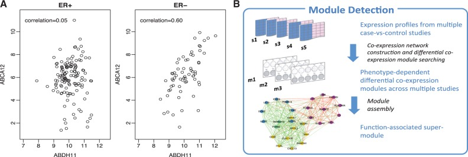
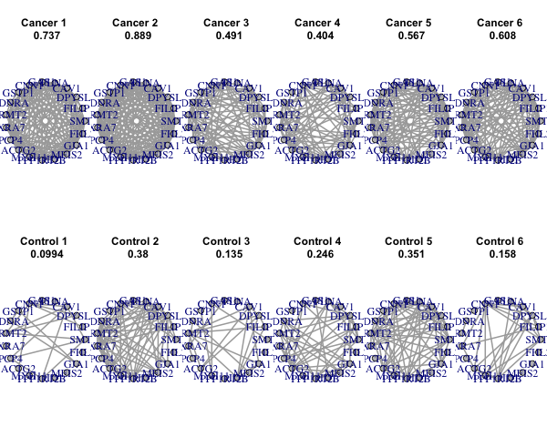

```{r,child="assets/header-lab.Rmd"}
```


```{r, eval=FALSE, echo=FALSE}
#save(QCresult, QCresult2, file = "results/QC.rda")
load(file = "./results/QC.rda")
```

## Installation and setup

Before we begin reading this tutorial and running the code, let us set
up our R environment for this session. We will be using "renv" package
in R to install all the necessary packages needed for the sessions.

> *Note: Due to the use of the development versions of R packages that
> are not available through conda repositories we are not able to
> generate a conda environment for this session and an alternative
> solution needs to be used.*

```{r}
setwd("~/Documents/GitHub/workshop_omics_integration/session_meta/")
getwd()
```

```{r, eval=FALSE}
## make sure that the renv.lock file for the session exists and do following.
install.packages("renv")

renv::restore(lockfile = "./Meta_tutorial/tuturial_meta.lock", prompt = TRUE) 

```

> If XML lib fails in ubuntu and you get the error "Error installing
> package 'XML':" go to terminal and install the libraries. "sudo
> apt-get update" followed by "sudo apt-get install libxml2-dev" Now,
> try the renv::init() again.
>> If you are trying to install within you conda environmen, you may need to install some dependencies
>> `install.packages(c("curl","remotes"))` and `remotes::install_github("joshuaulrich/TTR")`
>>  In bash of your active conda environment run `conda install -c conda-forge r-gert`
> There maybe issues with installtion even after these depending on you architecture,
> in that case you can locate the results for each of the sections in "results.tar.gz"
> file which you can expand by `tar -xvzf results.tar.gz` and explore the results.

# Introduction

Meta analyses are commonly used in clinical studies to assess the effect
of a treatment or a genetic locus on a phenotype. With the advent of
GWAS (Genome wide association studies), various studies report summary
statistics on associated effects of genetic loci on phenotype. Meta
analyses can be useful in determining whether the effect size is
consistent across the body of data

The goal of a synthesis is to understand the results of any study in the
context of all the other studies. First, we need to know whether or not
the effect size is consistent across the body of data. If it is
consistent, then we want to estimate the effect size as accurately as
possible and to report that it is robust across the kinds of studies
included in the synthesis. On the other hand, if it varies substantially
from study to study, we want to quantify the extent of the variance and
consider the implications. Meta-analysis is able to address these issues
whereas the narrative review is not. We start with an example to show
how meta-analysis and narrative review would approach the same question,
and then use this example to highlight the key differences between the
two.


# Meta analyses Methods

1.  **p-value**

<!-- -->

a.  [**Fisher**](https://link.springer.com/chapter/10.1007%2F978-1-4612-4380-9_6):
    Sum of minus log-transformed *P*-values where larger Fisher score
    reflects stronger aggregated differential expression evidence.
b.  [**Stouffer**](https://cutt.ly/rc53t31): Sum of inverse normal
    transformed *P*-values where larger Stouffer score to reflect
    stronger aggregated statistical evidence.
c.  [**adaptively weighted
    Fisher(AW)**](https://doi.org/10.1214/10-AOAS393)**, [original
    publication](https://ui.adsabs.harvard.edu/abs/2011arXiv1108.3180L/abstract)**
    : assigns different weights to each individual study  and it
    searches through all possible weights to find the best adaptive
    weight with the smallest derived *p*-value. One significant
    advantage of this method is its ability to indicate which studies
    contribute to the evidence aggregation and elucidates heterogeneity
    in the meta-analysis.
d.  [**minimum p-value
    (minP)**](https://psycnet.apa.org/record/1951-06623-001)**:** The
    minP method takes the minimum *p*-value among the *K* studies as the
    test statistic
e.  [**maximum p-value
    (maxP)**](https://psycnet.apa.org/record/1951-06623-001)**:** The
    maxP method takes maximum *p*-value as the test statistic
f.  [**rth ordered p-value
    (rOP)**](https://pubmed.ncbi.nlm.nih.gov/25383132/)**:** The rOP
    method takes the *r-*th order statistic among sorted *p*-values
    of *K*combined studies

> Note: The assumption of uniformly distributed *P*-values under the
> null hypothesis or can be done non-parametrically by permutation-based
> analysis

<!-- -->

2.  **Effect Size based**

<!-- -->

a.  [**fixed effects model
    (FEM)**](https://pubmed.ncbi.nlm.nih.gov/12855442/):FEM combines the
    effect size across *K* studies by assuming a simple linear model
    with an underlying true effect size plus a random error in each
    study
b.  [**random effects model
    (REM)**](https://pubmed.ncbi.nlm.nih.gov/12855442/): REM extends FEM
    by allowing random effects for the inter-study heterogeneity in the
    model. 

<!-- -->

3.  **Rank based**

<!-- -->

a.  [**rank product
    (rankProd)**](https://pubmed.ncbi.nlm.nih.gov/16982708/)RankProd and
    RankSum are based on the common biological belief that if a gene is
    repeatedly at the top of the lists ordered by up- or down-regulation
    fold change in replicate experiments, the gene is more likely a DE
    gene.
b.  [**naive sum of ranks and naive product of
    ranks**](https://pubmed.ncbi.nlm.nih.gov/16982708/)**:** These two
    methods apply a naïve product or sum of the DE evidence ranks across
    studies.

## Statistical considerations

In addition to statistical methods mentioned above, a number of factors
need to be considered for the choice of method. Different test
statistics maybe used depending on the type of outcome variable (e.g.
t-statistic or moderated t-statistic for binary outcome, F-statistic for
multi-class outcome, regression or correlation coefficient for
continuous outcome and log-rank statistic for survival outcome).

Here we will be using
[MetaDE](https://www.ncbi.nlm.nih.gov/pmc/articles/PMC3463115/) package
that has implemented above mentioned methods.

A summary of the methods and their implementations for respective
outcome variables are listed in the table below as presented in the
original publication.


For a detailed review of the applied methods for meta analyses, related
benchmarks and


## Required packages

```{r packages, warning=FALSE, message=FALSE, eval=TRUE}
library(magrittr)
library(plyr)
library(preproc)
library(MetaQC)
library(MetaDE)
library(MetaPath)
library(MetaDCN)


```


# Summary of the session

I this session we will be working with the "prostate8.rda" data set that
is located in the data directory of the "session_meta" directory of the
github repository for the course.

Some of the R packages packages we are using here are not available
through conda repositories and therefore need to be install from the
github repositories for the respective packages

The session comprises of following main steps

1.  Explore the data and the packages
2.  Filter the data based on QC
3.  Perform differential expression analyses and meta analyses
4.  Perfrom pathway analyses for meta analyses results
5.  Perfrom pathway meta analyses
6.  Network meta analyses (optional)
7.  Exercise: compare different meta analyses methods including
    AW-Fisher, REM, FEM \#\# Perform QC

# Data for the session

We will using prostate dataset

Load the protaste data set

```{r data, warning=FALSE}
load(file = "./data/prostate8.rda")
```

The prostate data is comprised of 8 microarray studies from different
microarray platforms. Here it is provided in a list format where data
matrices and corresponding labels are provided.

Let us take a quick look at the data.

```{r data-names, warning=FALSE, message=FALSE}
names(prostate8)
```

We can have a look at the structure of each data sets and evaluate what
sort of filtering steps we need to take.

```{r data-dims, warning=FALSE, message=FALSE}
library(magrittr)
lapply(prostate8$data, dim) %>% as.data.frame(row.names = c("genes", "samples"))
```

As we can see, the studies have different number of genes measured and
contain different number of samples. In a meta analyses, studies can
have different samples sizes but genes should match between different
studies. To be able to merge data sets, all data matrices should have
the same annotations

Let us look at the row names which are already set to gene names.

```{r data-view,  warning=FALSE, message=FALSE}
lapply(prostate8$data, row.names) %>% lapply(.,head, 5) %>% as.data.frame()
```

It is clear that the gene names are set to gene symbols for all data
sets and we can merge theses data set.

The second element of the lists corresponds to data labels where each
value corresponds to disease status of the individual where the sample
came from.

```{r data-label,  warning=FALSE}
prostate8$dataLabel %>% lapply(. ,table) %>% as.data.frame() %>% t
```

Data labels indicate "0" as control and "1" as disease groups. We can
set these values to character format for convenience.

If everything looks good, we are good to go to the next step.

> Take a moment to explore the data in your own ways and fimilarise
> yourself wit it.

------------------------------------------------------------------------

# Data preprocessing

## Gene matching

Usually different microarray platforms use their own probe IDs or
experiments from different omics platforms can have annotations for
transcripts of proteins. To perform meta-analysis, one needs to match
probe/transcript IDs from different platforms to the unique official
gene ID, such as ENTREZ ID or gene symbol.

Options for situations for microarray data include

-   take the average value of expression values across multiple probe
    IDs to represent the corresponded gene symbol
-   select the probe ID with the largest interquartile range (IQR) of
    expression
-   Or some version of summary at the gene level depending on the omics
    platform.

We do not cover the pre-processing steps for different omics
technologies at the moment but the workshop participants are encouraged
to apply the domain specific knowledge when setting up a meta analyses
study.

```{r data-overlap,  warning=FALSE, message=TRUE}
MetaQC::metaOverlap(prostate8$data) %>% 
                    lapply(dim) %>% as.data.frame(row.names = c("genes", "samples"))
```

As you can see here, only 4241 genes are present in all studies and if
we are to filter out this way, we lose a lot of data.

> Biologically, it is likely that most genes are either un-expressed or
> un-informative. In gene expression analysis to find DE genes, these
> genes contribute to the false discoveries, so it is desirable to
> filter out these genes prior to analysis. After genes are matched
> across studies, the unique gene symbols are available across all
> studies. Two sequential steps of gene filtering can be performed. In
> the first step, we filter out genes with very low gene expression that
> are identified with small average expression values across majority of
> studies. And then we can remove genes that are not variable in your data sets
> using variance estimates as they are not useful in comparisons.

You can take a look at [preproc]() package for some of the functions
available for filtering the data and the intuition behind the methods.
Here `Annotate(), Impute(), Filter() and Merge()` maybe useful for
pre-processing steps of the data analyses.

```{r preprocess, warning=FALSE, message=FALSE}
data2 <- prostate8$data
data2 <- preproc::Merge(data2)
data.type = rep("microarray", length(data2)) # a character vector for each study type

data2_filt <- preproc::Filter(data2, del.perc = c(0.1, 0.1),data.type = data.type ) # Here we specify the percentage of genes to be filtere, and specify the type of data for each study

summary_preproc <- rbind(as.data.frame(lapply(prostate8$data, dim))[1,],
                        as.data.frame(lapply(data2, dim))[1,], 
                        as.data.frame(lapply(data2_filt, dim))
                         )

rownames(summary_preproc) <- c("orginal", "merged", "mergeFiltered", "samples")

summary_preproc


```

Note that the multiple gene expression data sets may not be very well
aligned by genes, and the number of genes in each study maybe different.
When we combine a large number of studies, the number of common genes
may be very small, so we need to allow for genes appearing in most
studies and missing in few studies etc.


## Load pathway database

Let us perform quality control of the data for this meta analyses. We
are using the
["MetaQC"](https://academic.oup.com/nar/article/40/2/e15/2408973) that
identifies ways to objectively perform quality control for the
microarray studies.

```{r qc-1a, eval=FALSE, message=FALSE, warning=FALSE}
load(file = "./data/pathways.rda")

DList=prostate8$data
colLabel=prostate8$dataLabel
#GList=pathway[[1]]
#GList=pathwayDatabase

filterGenes=TRUE
cutRatioByMean=0.3 #
cutRatioByVar=0.3
#tic() not run
QCresult=MetaQC(DList, colLabel, GList=c(Hallmark.genesets, KEGG.genesets, Immunologic.genesets),filterGenes,cutRatioByMean,cutRatioByVar, ) ## This will take some time depending on the number of studies and the type of data
#toc()
```

> If you are unable to run the above steps, please load the "QC.rda" from
> the results directory of the session. 

```{r, echo=FALSE}
load("results/QC_step1.rda")
```


```{r qc-1b}
QCresult$scoreTable
```

`r colnames(QCresult$scoreTable)`

> Internal quality control index:small IQC indicated that the study had
> heterogeneous coexpression structure with other studies and was
> considered a candidate problematic study that should be excluded from
> meta-analysis
>
> the external quality control (EQC): small *EQC* indicated that the
> study had low association with pathway in terms of gene pairwise
> correlation structure and maybe considered a candidate problematic
> study.
>
> accuracy quality control (*AQC*) and a consistency quality control
> (*CQC*).
>
> Large *AQCg* measure for a given study indicate that DE genes produced
> by study were reproducible compared to DE genes detected by
> meta-analysis excluding study
>
> Having a large CQCg measure for a given study indicated that DE
> evidence produced by study was consistent with DE evidence generated
> by meta-analysis excluding study. Please read the original [MetQC
> publication](https://www.ncbi.nlm.nih.gov/pmc/articles/PMC3898528/#B14)
> for a better understanding of the measures.

We can now look at the two dimensional biplot based on PCA analyses and
get an idea of any studies that may not be of great quality.

```{r qc-plot}
MetaQC::plotMetaQC(QCresult$scoreTable)
```

Although the `plotMetaQC()` function is a useful tool for visualization,
it does not necessarily allow automatic inclusion/exclusion criteria.

Note that our visualization and summarization tools were not meant for
an automated recommendation for inclusion/exclusion decision. In the
examples we explored, there were roughly three categories in the QC
results: definite exclusion cases with poor quality, definite inclusion
cases with good quality and borderline cases. 

### Update based on the QC
Here Nanni and Tomlins are the two studies that maybe of low quality and
should perhaps be excluded from the analyses.

```{r remove-studies, message=FALSE, warning=FALSE}
filterGenes=TRUE
cutRatioByMean=0.3 #
cutRatioByVar=0.3
to_remove <- c("Nanni", "Tomlins")
prostate6 <- list(data = within(prostate8$data, rm(Nanni, Tomlins)), dataLabel=within(prostate8$dataLabel, rm(Nanni, Tomlins)))
prostate_fil <- list(data = MetaQC::metaOverlap(prostate6$data), dataLabel=prostate6$data)
prostate6$data <-MetaQC::metaFilterData(prostate_fil$data,cutRatioByVar = cutRatioByVar, cutRatioByMean = cutRatioByMean)
lapply(prostate6, names)

as.data.frame(lapply(prostate6$data, dim))

```

```{r qc-2, eval=FALSE, warning=FALSE, message=FALSE}
DList=prostate6$data
colLabel=prostate6$dataLabel
#GList=pathway[[1]]
#GList=pathwayDatabase
filterGenes=TRUE
cutRatioByMean=0.3 #
cutRatioByVar=0.3
QCresult2=MetaQC(DList, colLabel, GList=c(Hallmark.genesets, KEGG.genesets, Immunologic.genesets), filterGenes, cutRatioByMean, cutRatioByVar)
```

```{r, include=FALSE, eval=FALSE}
save(QCresult, file = "results/QC_step1.rda")
save(QCresult2, file = "results/QC_step2.rda")
```

> AGAIN, if you are unable to run the code, please load 

```{r}
load("results/QC_step2.rda")
```


```{r qc-2b}
QCresult2$scoreTable
```

```{r qc-plot-2}
plotMetaQC(scoreTable = QCresult2$scoreTable)

```


# Meta Differential Expression analyses

We have listed the methods for differential expression meta analyses in
the introduction section that are implemented in the MetaDE package.
Here we will try the best performing methods including AW Fischer, REM
and rOP. A detailed comparison of relative performances of each of the
statistical methods is descibed [Lun-Ching
etal](https://www.ncbi.nlm.nih.gov/pmc/articles/PMC3898528/#B14).

```{r de-meta-analyses, eval=TRUE, message=FALSE}

data <- prostate6$data # Extract the expression matrices
clin.data <- prostate6$dataLabel # extract lables for each sample

K <- length(data)

clin.data <- lapply(clin.data, function(x) {data.frame(x)} )

for (k in 1:length(clin.data)){
 colnames(clin.data[[k]]) <- "label"
 clin.data[[k]] <- (ifelse(clin.data[[k]]==0, "Control", "Cancer"))

}

#clin.data <- lapply(clin.data, function(x) {data.frame(x)} )
select.group <- c("Control", "Cancer")
ref.level <- "Control"
data.type <- "continuous"
ind.method <- rep('limma',length(data))
resp.type <- "twoclass"
paired <- rep(FALSE,length(data))


meta.method <- "Fisher"


meta.res <- MetaDE(data=data,clin.data = clin.data,
                    data.type=data.type,resp.type = resp.type,
                    response='label',
                    ind.method=ind.method, meta.method=meta.method,
                    select.group = select.group, ref.level=ref.level,
                    paired=paired,tail='abs',parametric=TRUE)
meta.res.summary <- MetaDE::summary.meta(meta.res, resp.type = resp.type, meta.method = meta.method)
head(meta.res.summary)
# save(meta.res, meta.res.summary, file = "./results/resMetaDE.rda")
```

> If you were unable to run the MetaDE analyses, you can load the results of the above 
> commands to review the output by usingh `load("./results/resMetaDE.rda")`

## Plot meta analyses results in a heatmap.

```{r plot-de-heatmap, eval=FALSE}

fdr.cut <- 1e-7
pdf('./results/heatmap.DE.pdf')
heatmap.sig.genes(meta.res, meta.method=meta.method,
                    fdr.cut=fdr.cut,color="GR")
dev.off()
```

{width=70%, height=150%}

## Pathway analyses based on meta analyses

At this stage, one can do pathway analyses directly on the genes that
appear to be differentially regulated based on the meta analyses
performed above.

```{r pathways-de, eval=FALSE}
meta.p  <- meta.res$meta.analysis$pval
ks.result <- PathAnalysis(meta.p = meta.p, enrichment = "KS")
fisher.result <- PathAnalysis(meta.p = meta.p, enrichment = "Fisher's exact")


## One can customize pathway datbase to update the results like following
load(file =  "./data/pathwayDatabase.rda")

## Let us look into the database
pathway_names <- pathwayDatabase %>% names() %>% stringr::str_split(pattern = "_", simplify = TRUE) %>% {.[,1]} %>% unique()
print(pathway_names)

path.res <- MetaDE::PathAnalysis(meta.p ,pathway = pathwayDatabase, p.cut = 0.05,
                    enrichment = "Fisher's exact", DEgene.number = 400, size.min = 10, size.max = 500)


```

```{r, include=FALSE}
#save(fisher.result, path.res, file = "./results/MetaDEPathways.rda")

```

> The pathway analyses performed here is based on the p-values obtained
> after the joint meta analyses of all the studies in your data. Some
> time individual study level pathway analyses is reported and we are
> interested in combining pathway level summary statistics. We will
> explore that in our next session where we will perform the analyses
> using **"MetaPath"** package.

## Exercise

-   Perform DE meta analyses using any two methods among "AW-Fisher",
    "FEM, "REM and "minMCC" and compare the number of differentially
    expressed genes detected at FDR \<0.05. Take a look at the
    `r ?MetaDE::MetaDE` function to change the parameters.

-   Perform pathway analyses based one of the methods you tried and see
    whether any differences at pathway level were detected.

```{r change-de-method, exercise=TRUE}
meta.method <- "AW"
meta.res <- MetaDE(data=data,clin.data = clin.data,
                    data.type=data.type,resp.type = resp.type,
                    response='label',covariate = NULL,
                    ind.method=ind.method, meta.method=meta.method,
                    select.group = select.group, ref.level=ref.level,
                    paired=paired, rth=NULL,
                    REM.type=NULL,tail='abs',parametric=TRUE)


```

```{r change-de-method-hint-1}
meta.method <- "FEM"
meta.res <- MetaDE(data=data,clin.data = clin.data,
                    data.type=data.type,resp.type = resp.type,
                    response='label',
                    ind.method=ind.method, meta.method=meta.method,
                    select.group = select.group, ref.level=ref.level,
                    paired=paired, tail='abs')

```

```{r change-de-method-hint-2}
meta.method <- "REM"
REM.type <- "HO"
meta.res <- MetaDE(data=data,clin.data = clin.data,
                    data.type=data.type,resp.type = resp.type,
                    response='label',
                    ind.method=ind.method, meta.method=meta.method,
                    select.group = select.group, ref.level=ref.level,
                    paired=paired,
                    REM.type=REM.type,tail='abs')

```

```{r change-de-method-hint-3}

meta.method <- 'minMCC'
meta.res <- MetaDE(data=data,clin.data = clin.data,
                    data.type=data.type,resp.type = resp.type,
                    response='label',
                    ind.method=ind.method, meta.method=meta.method,
                    select.group = select.group, ref.level=ref.level,
                    paired=paired,tail='abs',parametric=FALSE,nperm=100)

```


# Pathway analyses

## Introduction

Pathway analysis (a.k.a. gene set analysis) is a statistical tool to
infer correlation of differential expression evidence in the data with
pathway knowledge from established databases. The idea behind pathway
analysis is to determine if there is enrichment in the detected DE genes
based on an *a priori* defined biological category. Such a category
might come from one or multiple databases such as Gene Ontology
(GO; [www.geneontology.org](http://www.geneontology.org/)), the Kyoto
Encyclopedia of Genes and Genomes (KEGG; <http://www.genome.jp/kegg/>),
Biocarta Pathways (<http://www.biocarta.com/>) and the comprehensive
Molecular Signatures Database
(MSigDB; <http://www.broadinstitute.org/gsea/msigdb/>). For the majority
of recent microarray meta-analysis applications, pathway analysis has
been a standard follow-up to identify pathways associated with detected
DE genes [e.g.](https://pubmed.ncbi.nlm.nih.gov/17974971/)
and many others]. The result provides more insightful biological
interpretation and it has been reported that pathway analysis results
are usually more consistent and reproducible across studies than DE gene
detection. [Shen and Tseng](https://www.ncbi.nlm.nih.gov/pmc/articles/PMC2865865/)
developed a systematic framework of Meta-Analysis for Pathway Enrichment
(MAPE) by combining information at gene level, at pathway level and a
hybrid of the two. We will use this package for systematic analyses of microarray data from different studies.


## Step1: MAPE_P analysis

This is the first major function in the MetaPath2.0 package which combines the Meta-analysis for Pathway Enrichment (MAPE) methods introduced by Shen and Tseng (2010) and the Comparative Pathway Integrator (CPI) method introduced by [Fang and Tseng (2016)](https://www.biorxiv.org/content/10.1101/444604v1.full.pdf). The default function is CPI which performs MAPE_P (integrating multiple studies at pathway level) with Adaptively Weighted Fisher's method as Meta-analysis statistics. 


```{r pathway-meta-step-1, eval=FALSE}

#load("./data/pathways.rda")

CPI_result = MAPE2.0(arraydata = data , clinical.data = clin.data,
                    label = "label",pmtx = NULL,pathway = c(Biocarta.genesets, GOBP.genesets, 
        GOCC.genesets, GOMF.genesets, KEGG.genesets, Reactome.genesets), data.type ="discrete", 
        resp.type = "twoclass",method = "CPI", ind.method = rep("limma",length(data)),
        paired =rep(FALSE,length(data)),select.group=select.group, ref.level=ref.level ,
        tail="abs", enrichment = "Fisher's exact", DEgene.number = 400,stat = "AW Fisher")


save(CPI_result, file = "./results/MetaPEResults/MAPE_p_pathways.rds")
```


## Step 2


```{r pathway-meta-step-2, eval=FALSE}

set.seed(15213)
CPI.kappa_result = MAPE.Kappa(summary = CPI_result$summary,pathway = CPI_result$pathway,
                              max_k = 10, q_cutoff = 0.05,software = CPI_result$method, output_dir = "./results/MetaPEResults/")
```


## Step 3


```{r pathway-meta-step-3, eval=FALSE}
data(hashtb)
#data("./data/hashtb.rda")
#xx <- data(hashtb)
set.seed(1)
MAPE.Clustering.results <- MAPE.Clustering(summary=CPI_result$summary,Num_Clusters = 6,
                                kappa.result = CPI.kappa_result$kappa,sil_cut=0.01,
                                Num_of_gene_lists=CPI_result$Num_of_gene_lists,genelist =CPI_result$genelist,
                                pathway=CPI_result$pathway, enrichment=CPI_result$enrichment,
                                method=CPI.kappa_result$method,software=CPI_result$method,                                n.text.permute = 1000, output_dir = "./results/MetaPEResults/"  )
```
You can take a look at the "Clustering_Summary.csv" to gen an idea of reproducibility of pathways and the amount of evidence provided by each study.

Of the heat
{width=70%, height=120%}


------------------------------------------------------------------------


# Network Meta analyses using  MetaDCN

Co-expression analysis and network analysis of microarray data are used
to investigate potential transcriptional co-regulation and gene
interactions. Network analyses typically work with the gene--gene
co-expression matrix, which represents the correlation between each pair
of genes in the study. A crucial assumption is that the magnitude of the
co-expression between any pair of genes is associated with a greater
likelihood that the two genes interact. Thus, networks of interactions
between genes are inferred from the co-expression matrix. 

Here we will use [MetaDCN](https://www.ncbi.nlm.nih.gov/pmc/articles/PMC6041767/) to extract network modules in disease vs control conditions.



## Correction and adjacency matrices

```{r network-meta-1, eval=FALSE}
#data("./data/pathwayDatabase.rda")
#data(example)
# Generate correction and adjacency matrices for data and permutation
# GeneNet returns a list of information which will be used for SearchBM and MetaDCN function, and several RData files stored in folder path.
# AdjacencyMatrices.RData is a list of adjacency matrices for case and control in each study in the order of case studies and control studies.
# 
# CorrelationMatrices.RData is a list of correlation matrices for case and control in each study.
# 
# AdjacencyMatricesPermutationP.RData is a list of correlation matrices for case and control in each study in permutation P.
GeneNetRes.2  <- GeneNet(data , clin.data, caseName="Cancer", controlName="Control", meanFilter=0.8, SDFilter=0.8, edgeCutoff=0.1, permutationTimes=4, CPUNumbers=4,  pathwayDatabase=c(Biocarta.genesets,GOBP.genesets,GOCC.genesets,GOMF.genesets,
                    KEGG.genesets,Reactome.genesets), silent=FALSE, folder = "./results/MetaDCNResults/")
```

## Correlations/Co-expressions

```{r network-meta-2, eval=FALSE}
# This function will search for basic modules differentially co-expressed between case and control
# SearchBM will return a list and several Rdata, csv and png files saved in the folder path specified in GeneNet inputs.List of basic module information:

# w1	
# w1 weight with the most basic modules detected
# 
# BMInCase	
# data matrix listing the information of basic modules higher correlated in case
# 
# BMInControl	
# data matrix listing the information of basic modules higher correlated in control
# 
# permutation_energy_direction_p.Rdata is a list of energies of basic modules from permutation p.
# 
# basic_modules_summary_direction_weight_w.csv is a summary of basic modules detected using weight w in forward/backward search.
# 
# threshold_direction.csv is a table listing number of basic modules detected under different FDRs in forward/backward search.
# 
# figure_basic_module_c_repeat_r_direction_weight_w.png is a plot of basic module from component c repeat r using weight w in forward/backward search.

SearchBMRes <- SearchBM(GeneNetRes.2, MCSteps=500, jaccardCutoff=0.7, repeatTimes=5, outputFigure=TRUE, silent=FALSE )
```




## Find and assemble basic modules

```{r network-meta-3, eval=FALSE}
#This function will assemble basic modules detected from SearchBM into supermodules.
# w1:w1 used
# 
# BMInCaseSig: Summary of basic modules higher correlated in Case controling FDR
# 
# BMInControlSig	
# Summary of basic modules higher correlated in Control controling FDR
# 
# Supermodule: Summary of supermodules
#A number chosen from (100, 200, ..., 700) to specify the weight1 used in objective function (optional). If not specified, w1 from SearchBM function will be used (recommended).


MetaDNCRes <- MetaDCN(GeneNetRes.2, SearchBMRes, FDRCutoff=0.05, w1=NULL, silent=FALSE)

```


You get the modules, their pathway annotations and cytoscape files in the results directory.

For the final assembled modules have a look at the "module_assembly_summary_weight_500.csv" and find out ho many "supe modules you are able to identity on q value cut off of 0.05"


# Session info

```{r,echo=FALSE}
sessionInfo()
```

__End of document__
