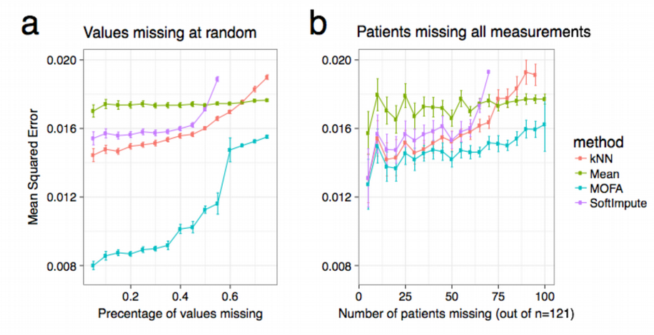

```{r setup, include=FALSE}
knitr::opts_chunk$set(echo = TRUE)
# #If you want to knit the whole notebook, please specify below correct path to the Rmd-file
knitr::opts_knit$set(root.dir="/home/jovyan/lab")

### be sure to update the environment name if applicable
library(reticulate)
reticulate::use_condaenv('UnsupervisedOMICsIntegration')
```


### Multi-OMICs Factor Analysis (MOFA)

MOFA is a typical hypothesis-free data exploration framework, [https://www.embopress.org/doi/10.15252/msb.20178124](https://www.embopress.org/doi/10.15252/msb.20178124). It allows data integration by extracting common axes of variation from the multiple OMICs layers. Given several data matrices with measurements of multiple ‘omics data types on the same or on
overlapping sets of samples, MOFA infers a low-dimensional data representation in
terms of (hidden) factors which can be then visualized and interpreted.


Importantly, MOFA disentangles whether the underlying axes of heterogeneity are unique to a single data modality or are manifested in multiple modalities, thereby identifying links between the different ‘omics. Once trained, the model output can be used for a range of downstream analyses, including

* **Visualisation of samples in factor space**
* **Annotation of factors using (gene set) enrichment analysis**
* **Imputation of missing values**
* **<span style="color:red">Support of sparse data</span>**
* **<span style="color:red">Support of OMICs with non-Gaussian distribution including binary and count data</span>**

How does a typical MOFA output look like? In the MOFA paper they applied this method to Chronic Lymphocytic Leukaemia (CLL) on 200 human patients that combined 1) drug response, 2) somatic mutations (targeted sequencing), 3) RNAseq data, and 4) Methylation array data.


Notably, nearly **40% of the 200 samples were profiled with some but not all OMICs types**; such a missing value scenario is not uncommon in large cohort studies, and MOFA is designed to cope with it. 

One can inspect loadings of MOFA hidden factors and observe known bio-markers fo CLL. Specifically, factor 1 was aligned with the somatic mutation status of the immunoglobulin heavy-chain variable region gene (IGHV), while Factor 2 aligned with trisomy of chromosome 12.

**Loadings from each factor can be used for pathway enrichment analysis. Interestingly, markers from diffeerent OMICs co-varying in a certain MOFA factor can be shown to be coupled to the same biological pathway**. For CLL data, factor 5 demonstrates co-variation between drug response and mRNA levels. This factor tagged a set of genes that were highly enriched for oxidative stress and senescence pathways. Consistent with the annotation based on the mRNA view, it is observed that the drugs with the strongest weights on Factor 5 were associated with response to oxidative stress, such as target reactive oxygen species, DNA damage response and apoptosis.

Next MOFA can perform efficient imputation of missing values including imputation of "missing patients", i.e. when a patient is present in one OMICs layer but absent in another, this absent layer can be reconstructed for the patient, i.e. gray bars in the panel a) of the figure above can be filled.



Finally, latent factors inferred by MOFA are predictive of clinical outcomes. The authors of MOFa paper assessed the prediction performance when combining the **10 MOFA factors** in a multivariate Cox regression model (assessed using cross-validation). Notably, this model yielded **higher prediction accuracy than the 10 factors derived from conventional PCA or using the individual features**.


Important to realize that despite the results of PCA and Factor Analysis visually look very similar, as they both provide linear variance-covariance matrix decomposition, they have quite a different math behind. While PCA is a pure matrix factorization technique which splits the total variance into orthogonal Principal Components (PCs), Factor Analysis seeks to construct hidden latent variables that generate the observed data, therefore Factor Analysis is a generative model.

&nbsp;

## Prepare scNMT Data Set for MOFA

In this section we will apply MOFA to the single cell multi-OMICs data set [scNMT](https://www.nature.com/articles/s41467-018-03149-4) which profiles chromatine accessebility (scATACseq), DNA methylation (scBSseq) and gene expression (scRNAseq) information from the same biological cells belonging to two types: differentiating mouse embryonic stem cells (ESCs) and embrionic bodies (EBs). We will start with reading and having a look at the individual OMICs data sets:

```{r,fig.width=10,fig.height=8}
scRNAseq<-read.delim("data/scRNAseq.txt", header = TRUE, check.names = FALSE, row.names = 1, sep="\t")
ens2genesymbol<-read.delim("data/ENSEMBLE_TO_GENE_SYMBOL_MOUSE.txt")
ens2genesymbol<-ens2genesymbol[match(colnames(scRNAseq),as.character(ens2genesymbol$ensembl_gene_id)),]
colnames(scRNAseq)<-ens2genesymbol$external_gene_name
scRNAseq<-as.data.frame(t(scRNAseq))
scRNAseq[1:5,1:5]

scBSseq<-read.delim("data/scBSseq.txt", header = TRUE, check.names = FALSE, row.names = 1, sep="\t")
scBSseq<-as.data.frame(t(scBSseq))
scBSseq[1:5,1:5]

scATACseq<-read.delim("data/scATACseq.txt", header = TRUE, check.names = FALSE, row.names = 1, sep="\t")
scATACseq<-as.data.frame(t(scATACseq))
scATACseq[1:5,1:5]
```

For scRNAseq OMIC layer we will only select highly expressed genes in order to remove noisy features that might contaminate the further downstream analysis. We will also perform log-transform of the data which can be seen as a mild normalization:

```{r,fig.width=10,fig.height=8}
scRNAseq<-scRNAseq[rowMeans(scRNAseq)>=1,]
scRNAseq<-log10(scRNAseq + 1)
scRNAseq[1:5,1:5]
dim(scRNAseq)
```

Since scBSseq and scATACseq OMIC layers should be almost binary (methylated vs unmethylated for scBSseq and open vs. close for scATACseq) data sets, a good way to get rid of redundancy in the scBSseq and scATACseq data (and thus perform feature pre-selection and reduce dimensions) is to select only features with high variability:


```{r,fig.width=10,fig.height=8}
library("mixOmics")
my_nearZeroVar<-nearZeroVar(as.data.frame(t(scBSseq)))
head(my_nearZeroVar$Metrics)
dim(my_nearZeroVar$Metrics)
scBSseq <- scBSseq[-which(rownames(scBSseq)%in%rownames(my_nearZeroVar$Metrics)),]
scBSseq[1:5,1:5]
dim(scBSseq)

my_nearZeroVar<-nearZeroVar(as.data.frame(t(scATACseq)), uniqueCut = 1)
head(my_nearZeroVar$Metrics)
dim(my_nearZeroVar$Metrics)
scATACseq <- scATACseq[-which(rownames(scATACseq)%in%rownames(my_nearZeroVar$Metrics)),]
scATACseq[1:5,1:5]
dim(scATACseq)
```

Let us now have a look at the histograms of individual OMICs layers in order to decide what distribution they follow and how we should model these distributions with MOFA:

```{r,fig.width=10,fig.height=8}
hist(rowMeans(scRNAseq),breaks=100, main = "scRNAseq")
hist(rowMeans(scBSseq), breaks = 100, main = "scBSseq")
hist(rowMeans(scATACseq), breaks = 100, main = "scATACseq")
```

We conclude that while scRNAseq data looks fairly Gaussian (or at least exponential), we should probably model the scBSseq and scATACseq data following Bernoulli distribution as they look quite bimodal indicating the binary nature of the data, i.e. methylated vs. unmethylated for scBSseq and open vs. close for scATACseq. To make the scBSseq and scATACseq data purely Bernoulli-like, we will further make the scBSseq and scATACseq data sets binary by encoding values below 50 as 0 and above 50 as 1. Since binary data typically have vey low variation compared to continuous data, we need to remove low-variance features in this case again:

```{r,fig.width=10,fig.height=8}
scBSseq<-ifelse(scBSseq<50,0,1)
scBSseq[1:5,1:5]
my_nearZeroVar<-nearZeroVar(as.data.frame(t(scBSseq)))
head(my_nearZeroVar$Metrics)
dim(my_nearZeroVar$Metrics)
scBSseq <- as.data.frame(scBSseq[-which(rownames(scBSseq)%in%rownames(my_nearZeroVar$Metrics)),])
scBSseq[1:5,1:5]
dim(scBSseq)

scATACseq<-ifelse(scATACseq<50,0,1)
my_nearZeroVar<-nearZeroVar(as.data.frame(t(scATACseq)))
head(my_nearZeroVar$Metrics)
dim(my_nearZeroVar$Metrics)
scATACseq <- as.data.frame(scATACseq[-which(rownames(scATACseq)%in%rownames(my_nearZeroVar$Metrics)),])
scATACseq[1:5,1:5]
dim(scATACseq)
```

Now data cleaning step is finished and the OMICs are prepared to be integrated in unsupervised way with MOFA.


## Run MOFA on scNMT Data Set

Let us continue with creating MOFA object. MOFA allows for a handy overview of the data by displaying dimensions of each OMIC.

```{r,fig.width=10,fig.height=8}
library("MOFA2")
omics<-list(scRNAseq=as.matrix(scRNAseq),scBSseq=as.matrix(scBSseq),scATACseq=as.matrix(scATACseq))
lapply(omics,dim)
MOFAobject <- create_mofa_from_matrix(omics)
plot_data_overview(MOFAobject, )
```

Now we will use some model training parameters such as distribution types corresponding to each OMIC, number of iterations, number of factors to be computed etc. 

```{r,fig.width=10,fig.height=8}
#DEFINE DATA OPTIONS
DataOptions <- get_default_data_options(MOFAobject)
DataOptions

#DEFINE MODEL OPTIONS
ModelOptions <- get_default_model_options(MOFAobject)
mydistr<-c("gaussian","bernoulli","bernoulli")
names(mydistr)<-c("scRNAseq","scBSseq","scATACseq")
ModelOptions$likelihoods<-mydistr
ModelOptions$num_factors<-20
ModelOptions

#DEFINE TRAIN OPTIONS
TrainOptions <- get_default_training_options(MOFAobject)
TrainOptions$seed <- 2018
# Automatically drop factors that explain less than 3% of variance in all omics
TrainOptions$drop_factor_threshold <- 0.03
# TrainOptions$tolerance <- 0.1
TrainOptions$maxiter<-1000
TrainOptions$verbose<-TRUE
TrainOptions
```

Finally, we are ready to run MOFA:

```{r,fig.width=10,fig.height=8, warning=F}
reticulate::use_python("/usr/local/miniconda3/envs/UnsupervisedOMICsIntegration/bin/python3")
reticulate::use_condaenv("UnsupervisedOMICsIntegration", required = TRUE)
```

```{r,fig.width=10,fig.height=8, warning=F}
MOFAobject <- prepare_mofa(MOFAobject, data_options = DataOptions, model_options = ModelOptions, training_options = TrainOptions)
MOFAobject <- run_mofa(MOFAobject, use_basilisk = FALSE)
MOFAobject
```

Let us check the covariance of the OMICs layers:

```{r,fig.width=10,fig.height=5}
#ANALYZE RESULTS OF MOFA INTEGRATION
head(get_variance_explained(MOFAobject)$r2_total[[1]])
head(get_variance_explained(MOFAobject)$r2_per_factor[[1]])

MOFAobject@cache$variance_explained
plot_list=plot_variance_explained(MOFAobject, x='view', y='factor', plot_total = T)
plot_list[[2]] #total variance
plot_list[[1]] #variance by factor
```

We can see that scRNAseq provides the largest variation (13%) in the total integrative OMICs scNMT data set, scBSseq and scATACseq contribute around 5% of variation. We also observe that MOFA selected 3 Latent Factors (LFs), scRNAseq contributes to all of them while scBSseq and scATACseq contributes only to the first LF. Now let us interpret the LFs by displaying the features associated with each LF:

```{r,fig.width=10,fig.height=8, warning=FALSE}
NumFactors<-dim(get_factors(MOFAobject)$group1)[2]

plot_weights(MOFAobject, view = "scRNAseq", factor = 1)
plot_top_weights(object = MOFAobject, view = "scRNAseq", factor = 1, nfeatures = 10)
plot_data_heatmap(object = MOFAobject, view = "scRNAseq", factor = "Factor1", features = 10, transpose = F, show_colnames=TRUE, show_rownames=TRUE,cluster_cols = TRUE)

plot_weights(MOFAobject, view = "scBSseq", factor = 1)
plot_top_weights(object = MOFAobject, view = "scBSseq", factor = 1, nfeatures = 10)
plot_data_heatmap(object = MOFAobject, view = "scBSseq", factor = "Factor1", features = 10, transpose = F, show_colnames=TRUE, show_rownames=TRUE,cluster_cols = TRUE)

plot_weights(MOFAobject, view = "scATACseq", factor = 1)
plot_top_weights(object = MOFAobject, view = "scATACseq", factor = 1, nfeatures = 10)
plot_data_heatmap(object = MOFAobject, view = "scATACseq", factor = "Factor1", features = 10, transpose = F, show_colnames=TRUE, show_rownames=TRUE,cluster_cols = TRUE)
```

Above we ranked by their importance and visualized features from each OMIC that contribute the most to the Factor 1 where all three OMICs (scRNAseq, scBSseq and scATACseq) are strongly correlated. Therefore one can expect those features to have something in common, i.e. they should also be correlated or involved in the same biological pathway.

Let us also display the cells in the low-dimensional latent space. for this purpose we will input MOFA factors into tSNE and UMAP and display the cells as a consensus plot for scRNAseq, scBSseq and scATACseq:

```{r,fig.width=10,fig.height=8, warning=F}
controls<-c("EB_P1D12","EB_P1E12","EB_P1F12","EB_P1G12","EB_P2B12","EB_P2D12","EB_P2E12","EB_P2F12","EB_P2G12",
            "ESC_B12","ESC_C12","ESC_D12")
colnames(scRNAseq)<-ifelse(colnames(scRNAseq)%in%controls,"CONTROL_CELL",colnames(scRNAseq))
cell_types<-matrix(unlist(strsplit(colnames(scRNAseq),"_")),ncol=2,byrow=TRUE)[,1]

sample_metadata <- data.frame(sample = samples_names(MOFAobject)[[1]],condition = cell_types)
samples_metadata(MOFAobject) <- sample_metadata
head(samples_metadata(MOFAobject), n=3)

set.seed(12345)
MOFAobject <- run_umap(MOFAobject, n_neighbors = round(sqrt(length(cell_types)),0), min_dist = 1)
MOFAobject <- run_tsne(MOFAobject, perplexity = round(sqrt(length(cell_types)),0))

plot_dimred(MOFAobject, method = "TSNE", dot_size = 3, color_by = "condition")
plot_dimred(MOFAobject, method = "UMAP", dot_size = 3, color_by = "condition")

#plot(MOFAobject@dim_red$TSNE$TSNE2~MOFAobject@dim_red$TSNE$TSNE1, col=as.factor(cell_types), xlab = "TSNE1", ylab = "TSNE2", pch=19,
#     main="tSNE representation of MOFA integration of scRNAseq, scBSseq and scATACseq", cex = 2)
#legend("bottomleft", inset=.02, levels(as.factor(cell_types)), fill=c("black","red","green"), cex=1.5)
#plot(MOFAobject@dim_red$UMAP$UMAP2~MOFAobject@dim_red$UMAP$UMAP1, col=as.factor(cell_types), xlab = "UMAP1", ylab = "UMAP2", pch=19,
#     main="UMAP representation of MOFA integration of scRNAseq, scBSseq and scATACseq", cex = 2)
#legend("bottomleft", inset=.02, levels(as.factor(cell_types)), fill=c("black","red","green"), cex=1.5)
```

We conclude that the MOFA unsupervised integrative OMICs approach can distinguish between all three types of cells: ESCs, EBs and Controls. Now let us see what MOFA factors contribute to different clusters:

```{r,fig.width=10,fig.height=8, warning=F}
plot_dimred(MOFAobject, method = "UMAP", dot_size = 3, color_by = "Factor1")
plot_dimred(MOFAobject, method = "UMAP", dot_size = 3, color_by = "Factor2")
plot_dimred(MOFAobject, method = "UMAP", dot_size = 3, color_by = "Factor3")
```

We can see that the ESC cluster is almost entirely driven by the MOFA Factor 1 meaning that all three OMICs (scRNAseq, scBSseq and scATACseq) contribute more or less equally into this cluster. In contrast the Control cluster is driven by the factor 2, which is mainly due to scRNAseq contribution. Finally, Factor 3 contributes more or less equally to all the three clusters implying that scRNAseq impacts all the three clusters.


## Session Info
```{r}
sessionInfo()
```

